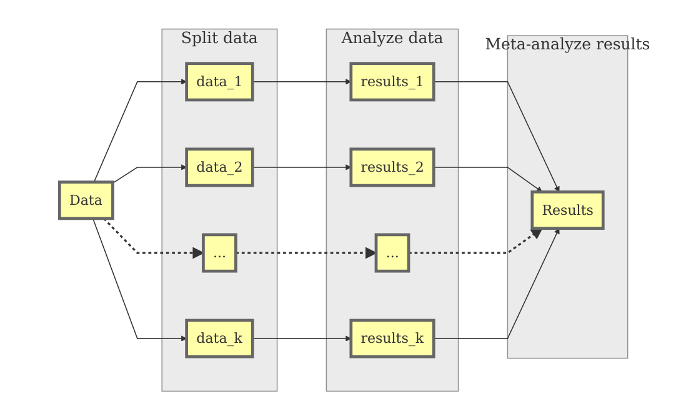

# Why not analyzing *all* raw data?
* The data sets are too huge for the RAM.
* Besides holding the data, lots of RAM are required for the analyses.
* It takes a long time to analyze all data.
* [John Tukey](https://en.wikiquote.org/wiki/John_Tukey): *An approximate answer to the right question is worth a great deal more than a precise answer to the wrong question.*

# Review of the Split/Analyze/Meta-analyze (SAM) Approach
* *Standard* approach to handle Big Data: MapReduce, Apache Hadoop, divide and conquer approach^[Chen, X., & Xie, M. (2014). A split-and-conquer approach for analysis of extraordinarily large data. *Statistica Sinica*, *24*(4), 1655–1684. https://doi.org/10.5705/ss.2013.088], ^[Matloff, N. (2016). Software Alchemy: Turning complex statistical computations into embarrassingly-parallel ones. *Journal of Statistical Software*, *71*(4), 1–15.]
* R: Split-analyze-apply^[Wickham, H. (2011). The split-apply-combine strategy for data analysis. *Journal of Statistical Software*, *40*(1), 1–29.]
* Limitations:
    + These approaches focus on simple tasks;
    + They are not meant to handle complex statistical modelings such as path models and structural equation modeling.
* The SAM approach extends this framework by using **meta-analysis** in the last step;
* Advantages:
    + Conventional multivariate techniques can be applied to big data.
    + Researchers can analyze big data from a theory testing approach.
* Graphical model


## Step 1: Splitting data 
* **Random split**: 
    + Randomly split the data into *k* pseudo "studies";
    + Pseudo "studies" are direct replicates of each other;
    + Pseudo "studies" are only different due to the sampling error; 
    + A fixed-effects meta-analysis is used to combine the results.
* **Stratified split**: 
    + Split the data according to some existing characteristics, e.g., geographic locations, time, into *k* pseudo "studies"; 
    + Pseudo "studies" may be different beyond sampling error;
    + Study characteristics may be used to explain these differences;
    + A random- and mixed-effects meta-analyses may be used to combine the results.

## Step 2: Analyzing data as separate "studies"    
* For example, regression, reliability analysis, path analysis, multilevel models, CFA, or even SEM.
* Suppose there are *p* parameter estimates; the effect sizes in the $i$th study are $y_i$ with its sampling variance-covariance matrix $V_i$.
    
## Step 3: Meta-analyzing results
* Apply univariate and multivariate meta-analyses, and meta-analytic structural modeling (MASEM) to synthesize the results;^[Cheung, M. W.-L. (2015). *Meta-analysis: A structural equation modeling approach*. Chichester, West Sussex: John Wiley & Sons.]
* We may apply the fixed-effects meta-analysis for the **random split**; otherwise, we may apply the random-effects meta-analysis for the **stratified split**.
* The random-effects meta-analytic model is,
    + $y_i = \beta_{Random} + u_i + e_i$ with $e_i \sim \mathcal{N}(0, V_i)$ and $u_i \sim \mathcal{N}(0, T^2)$
    + $\beta_{Random}$ is the vector of the average population effect size under a random-effects model;
    + $V_i$ is the conditional sampling covariance matrix of $y_i$;
    + $T^2$ is the heterogeneity variance of the random effects.
* The fixed-effects model is a special case when $T^2=0$.

## Preparing the datasets
* The datasets include more than 123 million records on 29 variables.
* The datasets are available at http://stat-computing.org/dataexpo/2009/the-data.html.
* The following R code is used to download the compressed files and uncompress them in the local hard disk.
* The compressed data sets are 1.7 GB in size, while the uncompressed files are 12 GB in size.
* Please make sure that there is enough space to store the files in your computer. Moreover, it may take a long time to download the files and uncompress them. Therefore, please **DON'T** download the files during this workshop. It will take forever to finish it.
* For the sake of time, I have already downloaded the data. Moreover, we will only use 1% of the data in the illustrations.
```{r}
## Don't run the code in the workshop!

library(R.utils)
library(dplyr)
library(readr)

## Years of the data
years <- 1987:2008

## Create file names to save in the local hard disk
file.names <- paste0(years, ".csv.bz2")

## Show the first few items
head(file.names)

## Create http addresses for download
http.names <- paste0("http://stat-computing.org/dataexpo/2009/", file.names)

## Show the first few items
head(http.names)
```

```{r, eval=FALSE, message=FALSE}
## Download the files
## This may take a while depending on the internet connectivity.
for (i in seq_along(http.names)) {
  download.file(http.names[i], file.names[i])
  cat("Downloaded file: ", file.names[i], "\n")
}

## Uncompress the files
## remove=FALSE: not to remove the compressed files
for (i in seq_along(file.names)) {
  bunzip2(file.names[i], overwrite=TRUE, remove=FALSE)
  cat("Unzipped file: ", file.names[i], "\n")
}

## Randomly select 1 % of the data and save it in "AirlinesDemo.RData"

## Set seed for reproducibility
set.seed(39133)

# Randomly select 1% of the data
size <- 0.01

## Select all files ended with ".csv""
my.list <- list.files(pattern = "*.csv$")
Airlines <- list()

## Read the CSV files
for (i in seq_along(my.list)) {
  Airlines[[i]] <- read_csv(my.list[i]) %>% group_by(Month) %>% 
                   sample_frac(size=size) %>%
                   select(Year, Month, DayofMonth, DayOfWeek, ArrDelay, 
                          DepDelay, Origin, Dest, Distance)
  cat("Completed dataset: ", my.list[i], "\n")
}

## Combine all data sets into a data.frame
Airlines <- bind_rows(Airlines)

## Save the data for this workshop
save(Airlines, file="AirlinesDemo.RData")
```

# Descriptive statistics
* We first demonstrate how to obtain some descriptive statistics before conducting inferential statistics.

## Read the database into R
* One percent of the data are saved in `AirlinesDemo.RData`. We may load this dataset in this workshop.
* When the dataset is too large, we may average them over some meaningful variables and display the averages.
* We summarize the means of the arrival delay, departure delay, and distance between airports per year and month.

```{r, eval=TRUE}
## Load the data for workshop
load("AirlinesDemo.RData")

library(dplyr)

## Calculate the means of ArrDelay, DepDelay, and total no. of flights
## grouped by year and month
my.summary <- Airlines %>% group_by(Year, Month) %>% 
              ## na.rm=TRUE: remove missing data in calculating the means
              summarise(arr_delay=mean(ArrDelay, na.rm = TRUE),
                        dep_delay=mean(DepDelay, na.rm = TRUE),
                        distance=mean(Distance, na.rm = TRUE),
                        flights=n())

## Sort it by Year and Month
my.summary <- my.summary %>% arrange(Year, Month)
my.summary

## Display the summary and figures
# The red lines in the figures refer to the *September 11 attacks*.

## values for x axis
x <- 1:nrow(my.summary)

## Plot the no. of flights
plot(x, my.summary$flights, type="l", xaxt="n",
     xlab="Year", ylab="Numbers of flights per month",
     main="Numbers of flights (0.1% of the data) per month by years (1987-2008)")
## Draw the dashed lines on Jan and add the last line at "256"
abline(v=c(x[my.summary$Month=="1"],256), lty=2)
## Draw the 911 attacks
abline(v=168, lwd=3, col="red")
## Add the "year" on Jun
axis(1, at=c(-3, x[my.summary$Month=="6"]), labels=1987:2008)

## Plot the delay time
par(mfrow=c(3,1))
plot(x, my.summary$arr_delay, type="l", xaxt="n",
     xlab="Year", ylab="Arrival delay (min)",
     main="Arrival delay by years and months")
abline(v=c(x[my.summary$Month=="1"],256), lty=2)
abline(v=168, lwd=3, col="red")
axis(1, at=c(-3, x[my.summary$Month=="6"]), labels=1987:2008)

plot(x, my.summary$dep_delay, type="l", xaxt="n",
     xlab="Year", ylab="Departure delay (min)",
     main="Departure delay by years and months")
abline(v=c(x[my.summary$Month=="1"],256), lty=2)
abline(v=168, lwd=3, col="red")
axis(1, at=c(-3, x[my.summary$Month=="6"]), labels=1987:2008)

plot(x, with(my.summary, arr_delay-dep_delay), type="l", xaxt="n",
     xlab="Year", ylab="Departure delay (min)",
     main="Arrival minus departure delay by years and months")
abline(v=c(x[my.summary$Month=="1"],256), lty=2)
abline(v=168, lwd=3, col="red")
abline(h=0, lty=2)
axis(1, at=c(-3, x[my.summary$Month=="6"]), labels=1987:2008)

## Plot the scatter plot
## Functions provided by the pairs() function
## See ?pairs
panel.cor <- function(x, y, digits = 2, prefix = "", cex.cor=2, ...)
{
    usr <- par("usr"); on.exit(par(usr))
    par(usr = c(0, 1, 0, 1))
    r <- cor(x, y)
    txt <- format(c(r, 0.123456789), digits = digits)[1]
    txt <- paste0(prefix, txt)
    text(0.5, 0.5, txt, cex = cex.cor)
}

panel.hist <- function(x, ...)
{
    usr <- par("usr"); on.exit(par(usr))
    par(usr = c(usr[1:2], 0, 1.5) )
    h <- hist(x, plot = FALSE)
    breaks <- h$breaks; nB <- length(breaks)
    y <- h$counts; y <- y/max(y)
    rect(breaks[-nB], 0, breaks[-1], y, col = "grey", ...)
}

pairs(my.summary[, c("arr_delay", "dep_delay", "distance", "flights")],
      lower.panel = panel.smooth, upper.panel = panel.cor,
      diag.panel = panel.hist)
```

## Ecological analysis
* One simple approach to handle large data sets is to use ecological analysis on the agregated means.
* However, it is important to note that results based on ecological analysis can be very different from those based on the raw data.
* We should not interpret results of the ecological analysis at the individual level; otherwise, we will commit an *ecological fallacy*.

```{r}
## I(distance/1000): Distance is divided by 1000 to improve numerical stability.
summary( lm(arr_delay~dep_delay+I(distance/1000), data=my.summary) )
```

# Regression analysis
* Now we would like to run the same regression model at the individual level by using the SAM approach.
* We regress `ArrDelay` on `DepDelay` and `Distance` on each year.
* The following figure displays the regression model.

```{r, echo=FALSE, message=FALSE}
## Load the library for meta-analysis
library(metaSEM)

my.model <- "ArrDelay~y1*DepDelay+y2*Distance"

## Display the graphica model
plot(my.model, col="yellow", sizeMan=10)
```

* When preparing the function for the analysis, please make sure that it handles potential errors in each analysis.
```{r}
## Load the library for meta-analysis
library(metaSEM)

## No. of cores in my old notebook
parallel::detectCores()

## Try to use multiple cores in OpenMx. It may speed up some of the analyses
## It is better to leave one core to the system and other operations.
mxOption(NULL, 'Number of Threads', (parallel::detectCores()-1))

## Function to fit regression analysis
## I(Distance/1000): Distance is divided by 1000 to improve numerical stability.
## y1 and y2: Regression coefficients from Distance and DepDelay.
## v11 to v22: Sampling covariance matrix of the parameter estimates
fun.reg <- function(dt) { 
           ## Run the analysis and capture the error
           fit <- try(lm(ArrDelay~DepDelay+I(Distance/1000), data=dt), silent=TRUE)

           ## If it is an error, returns NA
           if (is.element("try-error", class(fit))) {
               c(y1=NA, y2=NA, v11=NA, v21=NA, v22=NA)
              } else {
               ## Regression coefficients excluding the intercept
               ## Remove the additional names 
               y <- unname(coef(fit))
               ## sampling variance-covariance matrix excluding the intercept
               ## vech() takes the lower triangle matrix including the diagonals
               v <- vech(vcov(fit)[-1, -1])
               c(y1=y[2], y2=y[3], v11=v[1], v21=v[2], v22=v[3])
              }
}
```

## Random split (fixed-effects meta-analysis)
* We may randomly split the data into *k* groups. There is a total of `r nrow(Airlines)` rows in the dataset. We randomly split it into 100 groups.

```{r}
## Set seed for reproducibility
set.seed(569840)

no.of.group <- 100

Airlines$Group <- sample(1:nrow(Airlines)) %% no.of.group + 1

## Display the frequency table
table(Airlines$Group)

## Run the analysis by Group and save the results in "meta.df0"
meta.df0 <- Airlines %>% group_by(Group) %>% do(mod=fun.reg(.))

## Group: 1 to 100
## mod: y1, y2, v11, v21, and v22
meta.df0

## It is easier to work with a matrix or data frame.
## Let's convert it into a matrix
## Extract the results from "mod" and convert them into a matrix
meta.df0 <- t(apply(meta.df0, 1, function(x) x$mod))
head(meta.df0)

## Meta-analyze results by using a random-effects meta-analysis
## y1: regression coefficient of DepDelay
## y2: regression coefficient of Distance/1000
## RE.constraints = matrix(0, ncol=2, nrow=2): Fixed-effects model
FEM.reg <- meta(y=cbind(y1,y2), v=cbind(v11,v21,v22), data=meta.df0,
                RE.constraints = matrix(0, ncol=2, nrow=2),
                model.name="Fixed effects model")
summary(FEM.reg)
```

## Stratified split (random-effects meta-analysis)
* Since the data are grouped under `Year`, it is more appropriate to use the stratified split.

```{r}
## Run the analysis by Year
meta.df1 <- Airlines %>% group_by(Year) %>% do(mod=fun.reg(.))
meta.df1

## Append Year in the data frame
meta.df1 <- data.frame(Year=meta.df1$Year,
                       t(apply(meta.df1, 1, function(x) x$mod)))
head(meta.df1)
```

* An alternative way with a `for` loop, which is useful when the dataset is really huge.
```{r, eval=FALSE}
## Data.frame to store output
meta.df1 <- data.frame(Year=NA,y1=NA,y2=NA,v11=NA,v21=NA,v22=NA)

## Years for the analyses
Year <- unique(Airlines$Year)

for (i in seq_along(Year)){
    ## Fit regression model and store results
    meta.df1[i, ] <- c(Year[i], fun.reg(Airlines[Airlines$Year==Year[i], ]))
    cat("Completed year: ", Year[i], "\n")
}
head(meta.df1)
```

## Conducting a multivariate random and mixed-effects meta-analysis
* The regression coefficients on `DepDelay` (y1) and on `Distance` (y2) are considered as multiple effect sizes.
* Random-effects multivariate meta-analysis is conducted to account for the differences in `year`. Moreover, `year` is included as a study characteristic in a mixed-effects multivariate meta-analysis.
```{r, message=FALSE}
## Meta-analyze results by using a random-effects meta-analysis
## y1: regression coefficient of DepDelay
## y2: regression coefficient of Distance/1000
REM.reg <- meta(y=cbind(y1,y2), v=cbind(v11,v21,v22), data=meta.df1,
                model.name="Random effects model")
summary(REM.reg)

## Variance components of the random effects
VarComp.reg <- vec2symMat(coef(REM.reg, select="random"))
VarComp.reg

## Correlation between the random effects
cov2cor(VarComp.reg)

## Plot the effect sizes
plot(REM.reg, axis.labels=c("Regression coefficient DepDelay",
                            "Regression coefficient Distance"),
     ylim=c(-2.5,0.7), xlim=c(0.65,1.2), study.min.cex = 0.6)

## Mixed effects meta-analysis with the year as a moderator
## year was centered before the analysis.
REM.reg_mod <- meta(y=cbind(y1,y2), v=cbind(v11,v21,v22),
                    x = scale(Year, scale=FALSE), data=meta.df1,
                    model.name="Regression analysis REM with year as moderator")
summary(REM.reg_mod)
```

# Mixed-effects model
* A mixed-effects model is fitted to account for the nested structure of the data. The seasonal variation is approximately accounted for by considering the data nested in *Month*, *Day of Month*, *Day Of Week*, while geographical differences is approximately accounted for by considering the data cross-classified in *origin* and *destination* airports.

## Read and process data from the database
* Since it takes some time to process large data, the database has been stored as an R object.
```{r, eval=FALSE}
library(lme4)

## Function to fit regression analysis  
## y1 to y3: Intercept, DepDelay and Distance/1000.
## v11 to v33: Sampling covariance matrix of the parameter estimates
fun.lmer <- function(dt) {  fit <- try(lmer(ArrDelay~DepDelay+I(Distance/1000)+
                                       (1|Month)+(1|DayofMonth)+(1|DayOfWeek)+
                                       (1|Origin)+(1|Dest),
                                       REML=FALSE, na.action="na.omit",
                                       data=dt), silent=TRUE)
                            if (is.element("try-error", class(fit))) {
                                c(y1=NA, y2=NA, v11=NA, v21=NA, v22=NA)
                                } else {
                                ## regression coefficients excluding the intercept
                                y <- unname(fixef(fit)[-1])
                                ## sampling variance-covariance matrix excluding the intercept
                                v <- vcov(fit)[-1, -1]
                                c(y1=y[1],y2=y[2],v11=v[1,1],v21=v[2,1],v22=v[2,2])
                                }
}

## Run the analysis by Year
## It may takes several minuates!
meta.df2 <- Airlines %>% group_by(Year) %>% do(mod=fun.lmer(.))
meta.df2

meta.df2 <- data.frame(Year=meta.df2$Year,
                       t(apply(meta.df2, 1, function(x) x$mod)))
save(meta.df2, file="Airlineslme.RData")
```

## Conducting a multivariate random-effects meta-analysis
* The regression coefficients on `DepDelay` (y1) and on `Distance` (y2) are considered as multiple effect sizes.
```{r, message=FALSE}
## Load the data to avoid long computation
load("Airlineslme.RData")

head(meta.df2)

## Meta-analyze results by using a random-effects meta-analysis
## y1: regression coefficient of DepDelay
## y2: regression coefficient of Distance/1000
REM.lmer <- meta(y=cbind(y1,y2), v=cbind(v11,v21,v22), data=meta.df2,
                 model.name="Random effects model")
summary(REM.lmer)

## Variance component of the random effects
VarComp.lmer <- vec2symMat(coef(REM.lmer, select="random"))
VarComp.lmer

## Correlation between the random effects
cov2cor(VarComp.lmer)

plot(REM.lmer, axis.labels=c("Regression coefficient on DepDelay",
                             "Regression coefficient on Distance"),
     ylim=c(-2.5,0.7), xlim=c(0.65,1.2), study.min.cex = 0.6)
```

## Conducting a multivariate mixed-effects meta-analysis
* A multivariate mixed-effects meta-analysis is conducted by using `Year` as the moderator.
```{r}
## Meta-analyze results with a mixed-effects meta-analysis with year as a predictor
## It may be necessary to use better starting values
## since the variances of the variance components are very different.
meta.mem <- meta(y=cbind(y1,y2), v=cbind(v11,v21,v22), data=meta.df2,
                 x=scale(Year, scale=FALSE),
                 model.name="Mixed effects model with year as a predictor")
summary(meta.mem)
```

# A comparison
* Are the results very different among the random split, stratified split (by year), and stratified split (by year) with lmer?
    
```{r}
## Parameter estimates
cbind(`Random`=coef(FEM.reg), 
      `Stratified (by year)`=coef(REM.reg, select="fixed"),
      `Stratified with lmer`=coef(REM.lmer, select = "fixed"))

## Function to get the SE
SE <- function(x) sqrt(diag(vcov(x, select="fixed")))

## Standard errors
cbind(`Random`=SE(FEM.reg), 
      `Stratified (by year)`=SE(REM.reg),
      `Stratified with lmer`=SE(REM.lmer))
```

# Settings of the R system
```{r}
sessionInfo()
```