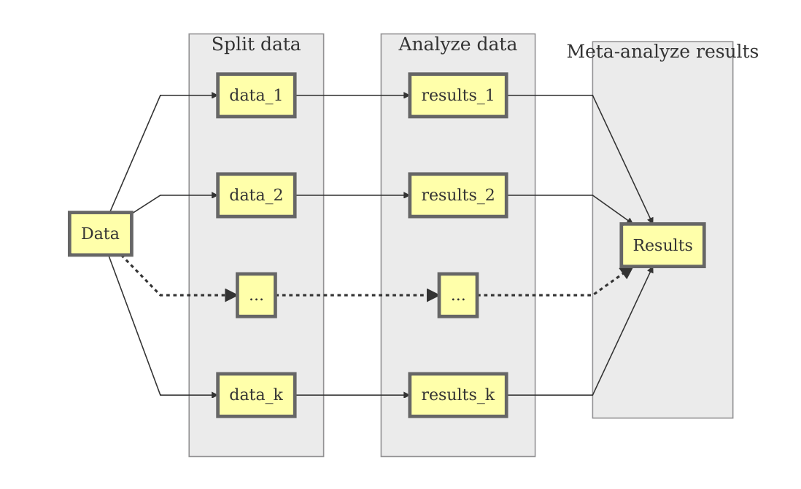
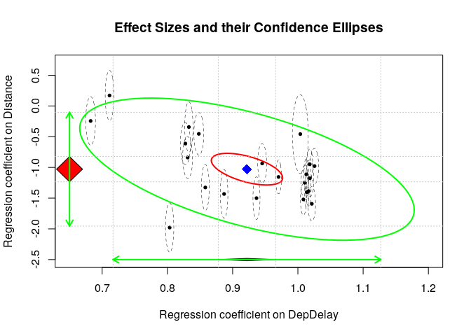

# Why not analyzing *all* raw data?
* The data sets are too large for the RAM.
* Besides holding the data, lots of RAM are required for the operations and analyses.
* It takes too long to analyze all data.
* [John Tukey](https://en.wikiquote.org/wiki/John_Tukey): *An approximate answer to the right question is worth a great deal more than a precise answer to the wrong question.*

# Review of the Split/Analyze/Meta-analyze (SAM) Approach
* *Standard* approach to handle Big Data: MapReduce, Apache Hadoop, divide and conquer approach^[Chen, X., & Xie, M. (2014). A split-and-conquer approach for analysis of extraordinarily large data. *Statistica Sinica*, *24*(4), 1655–1684. https://doi.org/10.5705/ss.2013.088], ^[Matloff, N. (2016). Software Alchemy: Turning complex statistical computations into embarrassingly-parallel ones. *Journal of Statistical Software*, *71*(4), 1–15.]
* R: Split-analyze-apply^[Wickham, H. (2011). The split-apply-combine strategy for data analysis. *Journal of Statistical Software*, *40*(1), 1–29.]
* Limitations:
    + These approaches focus on simple tasks;
    + They are not meant to handle complex statistical modelings such as path models and structural equation modeling.
* The SAM approach extends this framework by using **meta-analysis** in the last step;
* Advantages:
    + Conventional multivariate techniques can be applied to big data.
    + Researchers can analyze big data from a theory testing approach.
* Graphical model


## Step 1: Splitting data 
* **Random split**: 
    + Randomly split the data into *k* pseudo "studies";
    + Pseudo "studies" are direct replicates of each other;
    + Pseudo "studies" are only different due to the sampling error; 
    + A fixed-effects meta-analysis is used to combine the results.
* **Stratified split**: 
    + Split the data according to some existing characteristics, e.g., geographic locations, time, into *k* pseudo "studies"; 
    + Pseudo "studies" may be different beyond sampling error;
    + Study characteristics may be used to explain these differences;
    + A random- and mixed-effects meta-analyses may be used to combine the results.

## Step 2: Analyzing data as separate "studies"    
* For example, regression, reliability analysis, path analysis, multilevel models, CFA, or even SEM.
* Suppose there are *p* parameter estimates; the effect sizes in the $i$th study are $y_i$ with its sampling variance-covariance matrix $V_i$.
    
## Step 3: Meta-analyzing results
* Apply univariate and multivariate meta-analyses, and meta-analytic structural modeling (MASEM) to synthesize the results;^[Cheung, M. W.-L. (2015). *Meta-analysis: A structural equation modeling approach*. Chichester, West Sussex: John Wiley & Sons.]
* We may apply the fixed-effects meta-analysis for the **random split**; otherwise, we may apply the random-effects meta-analysis for the **stratified split**.
* The random-effects meta-analytic model is,
    + $y_i = \beta_{Random} + u_i + e_i$ with $e_i \sim \mathcal{N}(0, V_i)$ and $u_i \sim \mathcal{N}(0, T^2)$
    + $\beta_{Random}$ is the vector of the average population effect size under a random-effects model;
    + $V_i$ is the conditional sampling covariance matrix of $y_i$;
    + $T^2$ is the heterogeneity variance of the random effects.
* The fixed-effects model is a special case when $T^2=0$.

# Preparing the datasets
* The datasets include more than 123 million records on 29 variables.
* The datasets are available at http://stat-computing.org/dataexpo/2009/the-data.html.
* The following R code is used to download the compressed files and uncompress them in the local hard disk.
* The compressed data sets are 1.7 GB in size, while the uncompressed files are 12 GB in size.
* Please make sure that there is enough space to store the files in your computer. Moreover, it may take a long time to download the files and uncompress them. Therefore, please **DON'T** download the files during this workshop. It will take forever to finish it.
* For the sake of time, I have already downloaded the data. Moreover, we will only use 1% of the data in the illustrations.

```r
## Don't run the code in the workshop!

library(R.utils)
```

```
## Loading required package: R.oo
```

```
## Loading required package: R.methodsS3
```

```
## R.methodsS3 v1.7.1 (2016-02-15) successfully loaded. See ?R.methodsS3 for help.
```

```
## R.oo v1.22.0 (2018-04-21) successfully loaded. See ?R.oo for help.
```

```
## 
## Attaching package: 'R.oo'
```

```
## The following objects are masked from 'package:methods':
## 
##     getClasses, getMethods
```

```
## The following objects are masked from 'package:base':
## 
##     attach, detach, gc, load, save
```

```
## R.utils v2.6.0 (2017-11-04) successfully loaded. See ?R.utils for help.
```

```
## 
## Attaching package: 'R.utils'
```

```
## The following object is masked from 'package:utils':
## 
##     timestamp
```

```
## The following objects are masked from 'package:base':
## 
##     cat, commandArgs, getOption, inherits, isOpen, parse, warnings
```

```r
library(dplyr)
```

```
## 
## Attaching package: 'dplyr'
```

```
## The following objects are masked from 'package:stats':
## 
##     filter, lag
```

```
## The following objects are masked from 'package:base':
## 
##     intersect, setdiff, setequal, union
```

```r
library(readr)

## Years of the data
years <- 1987:2008

## Create file names to save in the local hard disk
file.names <- paste0(years, ".csv.bz2")

## Show the first few items
head(file.names)
```

```
## [1] "1987.csv.bz2" "1988.csv.bz2" "1989.csv.bz2" "1990.csv.bz2"
## [5] "1991.csv.bz2" "1992.csv.bz2"
```

```r
## Create http addresses for download
http.names <- paste0("http://stat-computing.org/dataexpo/2009/", file.names)

## Show the first few items
head(http.names)
```

```
## [1] "http://stat-computing.org/dataexpo/2009/1987.csv.bz2"
## [2] "http://stat-computing.org/dataexpo/2009/1988.csv.bz2"
## [3] "http://stat-computing.org/dataexpo/2009/1989.csv.bz2"
## [4] "http://stat-computing.org/dataexpo/2009/1990.csv.bz2"
## [5] "http://stat-computing.org/dataexpo/2009/1991.csv.bz2"
## [6] "http://stat-computing.org/dataexpo/2009/1992.csv.bz2"
```


```r
## Download the files
## This may take a while depending on the internet connectivity.
for (i in seq_along(http.names)) {
  download.file(http.names[i], file.names[i])
  cat("Downloaded file: ", file.names[i], "\n")
}

## Uncompress the files
## remove=FALSE: not to remove the compressed files
for (i in seq_along(file.names)) {
  bunzip2(file.names[i], overwrite=TRUE, remove=FALSE)
  cat("Unzipped file: ", file.names[i], "\n")
}

## Randomly select 1 % of the data and save it in "AirlinesDemo.RData"

## Set seed for reproducibility
set.seed(39133)

# Randomly select 1% of the data
size <- 0.01

## Select all files ended with ".csv""
my.list <- list.files(pattern = "*.csv$")
Airlines <- list()

## Read the CSV files
for (i in seq_along(my.list)) {
  Airlines[[i]] <- read_csv(my.list[i]) %>% group_by(Month) %>% 
                   sample_frac(size=size) %>%
                   select(Year, Month, DayofMonth, DayOfWeek, ArrDelay, 
                          DepDelay, Origin, Dest, Distance)
  cat("Completed dataset: ", my.list[i], "\n")
}

## Combine all data sets into a data.frame
Airlines <- bind_rows(Airlines)

## Save the data for this workshop
save(Airlines, file="AirlinesDemo.RData")
```

## Descriptive statistics
* We first demonstrate how to obtain some descriptive statistics before conducting inferential statistics.

## Read the database into R
* One percent of the data are saved in `AirlinesDemo.RData`. We may load this dataset in this workshop.
* When the dataset is too large, we may average them over some meaningful variables and display the averages.
* We summarize the means of the arrival delay, departure delay, and distance between airports per year and month.


```r
## Load the data for workshop
load("AirlinesDemo.RData")

library(dplyr)

## Calculate the means of ArrDelay, DepDelay, and total no. of flights
## grouped by year and month
my.summary <- Airlines %>% group_by(Year, Month) %>% 
              ## na.rm=TRUE: remove missing data in calculating the means
              summarise(arr_delay=mean(ArrDelay, na.rm = TRUE),
                        dep_delay=mean(DepDelay, na.rm = TRUE),
                        distance=mean(Distance, na.rm = TRUE),
                        flights=n())

## Sort it by Year and Month
my.summary <- my.summary %>% arrange(Year, Month)
my.summary
```

```
## # A tibble: 255 x 6
## # Groups:   Year [22]
##     Year Month arr_delay dep_delay distance flights
##    <int> <int>     <dbl>     <dbl>    <dbl>   <int>
##  1  1987    10      6.51      5.12     594.    4486
##  2  1987    11      7.73      6.15     601.    4228
##  3  1987    12     13.8      12.0      602.    4404
##  4  1988     1     11.9      10.6      594.    4370
##  5  1988     2      9.12      8.49     603.    4126
##  6  1988     3      6.79      6.43     598.    4451
##  7  1988     4      5.29      6.04     603.    4273
##  8  1988     5      6.67      7.09     619.    4359
##  9  1988     6      4.15      5.32     604.    4313
## 10  1988     7      6.33      7.36     613.    4411
## # ... with 245 more rows
```

```r
## Display the summary and figures
# The red lines in the figures refer to the *September 11 attacks*.

## values for x axis
x <- 1:nrow(my.summary)

## Plot the no. of flights
plot(x, my.summary$flights, type="l", xaxt="n",
     xlab="Year", ylab="Numbers of flights per month",
     main="Numbers of flights (0.1% of the data) per month by years (1987-2008)")
## Draw the dashed lines on Jan and add the last line at "256"
abline(v=c(x[my.summary$Month=="1"],256), lty=2)
## Draw the 911 attacks
abline(v=168, lwd=3, col="red")
## Add the "year" on Jun
axis(1, at=c(-3, x[my.summary$Month=="6"]), labels=1987:2008)
```

<!-- -->

```r
## Plot the delay time
par(mfrow=c(3,1))
plot(x, my.summary$arr_delay, type="l", xaxt="n",
     xlab="Year", ylab="Arrival delay (min)",
     main="Arrival delay by years and months")
abline(v=c(x[my.summary$Month=="1"],256), lty=2)
abline(v=168, lwd=3, col="red")
axis(1, at=c(-3, x[my.summary$Month=="6"]), labels=1987:2008)

plot(x, my.summary$dep_delay, type="l", xaxt="n",
     xlab="Year", ylab="Departure delay (min)",
     main="Departure delay by years and months")
abline(v=c(x[my.summary$Month=="1"],256), lty=2)
abline(v=168, lwd=3, col="red")
axis(1, at=c(-3, x[my.summary$Month=="6"]), labels=1987:2008)

plot(x, with(my.summary, arr_delay-dep_delay), type="l", xaxt="n",
     xlab="Year", ylab="Departure delay (min)",
     main="Arrival minus departure delay by years and months")
abline(v=c(x[my.summary$Month=="1"],256), lty=2)
abline(v=168, lwd=3, col="red")
abline(h=0, lty=2)
axis(1, at=c(-3, x[my.summary$Month=="6"]), labels=1987:2008)
```

<!-- -->

```r
## Plot the scatter plot
## Functions provided by the pairs() function
## See ?pairs
panel.cor <- function(x, y, digits = 2, prefix = "", cex.cor=2, ...)
{
    usr <- par("usr"); on.exit(par(usr))
    par(usr = c(0, 1, 0, 1))
    r <- cor(x, y)
    txt <- format(c(r, 0.123456789), digits = digits)[1]
    txt <- paste0(prefix, txt)
    text(0.5, 0.5, txt, cex = cex.cor)
}

panel.hist <- function(x, ...)
{
    usr <- par("usr"); on.exit(par(usr))
    par(usr = c(usr[1:2], 0, 1.5) )
    h <- hist(x, plot = FALSE)
    breaks <- h$breaks; nB <- length(breaks)
    y <- h$counts; y <- y/max(y)
    rect(breaks[-nB], 0, breaks[-1], y, col = "grey", ...)
}

pairs(my.summary[, c("arr_delay", "dep_delay", "distance", "flights")],
      lower.panel = panel.smooth, upper.panel = panel.cor,
      diag.panel = panel.hist)
```

<!-- -->

## Ecological analysis
* One simple approach to handle large data sets is to use ecological analysis on the agregated means.
* However, it is important to note that results based on ecological analysis can be very different from those based on the raw data.
* We should not interpret results of the ecological analysis at the individual level; otherwise, we will commit an *ecological fallacy*.


```r
## I(distance/1000): Distance is divided by 1000 to improve numerical stability.
summary( lm(arr_delay~dep_delay+I(distance/1000), data=my.summary) )
```

```
## 
## Call:
## lm(formula = arr_delay ~ dep_delay + I(distance/1000), data = my.summary)
## 
## Residuals:
##      Min       1Q   Median       3Q      Max 
## -3.11415 -0.41559  0.00821  0.50204  1.75044 
## 
## Coefficients:
##                   Estimate Std. Error t value Pr(>|t|)    
## (Intercept)        7.72759    0.66850   11.56   <2e-16 ***
## dep_delay          1.19525    0.01588   75.29   <2e-16 ***
## I(distance/1000) -14.88060    0.99760  -14.92   <2e-16 ***
## ---
## Signif. codes:  0 '***' 0.001 '**' 0.01 '*' 0.05 '.' 0.1 ' ' 1
## 
## Residual standard error: 0.7131 on 252 degrees of freedom
## Multiple R-squared:  0.9581,	Adjusted R-squared:  0.9578 
## F-statistic:  2882 on 2 and 252 DF,  p-value: < 2.2e-16
```

# Regression analysis
* Now we would like to run the same regression model at the individual level by using the SAM approach.
* We regress `ArrDelay` on `DepDelay` and `Distance` on each year.
* The following figure displays the regression model.

<!-- -->

* When preparing the function for the analysis, please make sure that it handles potential errors in each analysis.

```r
## Load the library for meta-analysis
library(metaSEM)

## No. of cores in my old notebook
parallel::detectCores()
```

```
## [1] 4
```

```r
## Try to use multiple cores in OpenMx. It may speed up some of the analyses
## It is better to leave one core to the system and other operations.
mxOption(NULL, 'Number of Threads', (parallel::detectCores()-1))

## Function to fit regression analysis
## I(Distance/1000): Distance is divided by 1000 to improve numerical stability.
## y1 and y2: Regression coefficients from Distance and DepDelay.
## v11 to v22: Sampling covariance matrix of the parameter estimates
fun.reg <- function(dt) { 
           ## Run the analysis and capture the error
           fit <- try(lm(ArrDelay~DepDelay+I(Distance/1000), data=dt), silent=TRUE)

           ## If it is an error, returns NA
           if (is.element("try-error", class(fit))) {
               c(y1=NA, y2=NA, v11=NA, v21=NA, v22=NA)
              } else {
               ## Regression coefficients excluding the intercept
               ## Remove the additional names 
               y <- unname(coef(fit))
               ## sampling variance-covariance matrix excluding the intercept
               ## vech() takes the lower triangle matrix including the diagonals
               v <- vech(vcov(fit)[-1, -1])
               c(y1=y[2], y2=y[3], v11=v[1], v21=v[2], v22=v[3])
              }
}
```

## Random split (fixed-effects meta-analysis)
* We may randomly split the data into *k* groups. There is a total of 1235354 rows in the dataset. We randomly split it into 100 groups.


```r
## Set seed for reproducibility
set.seed(569840)

k <- 100

## %% reminder, e.g., 10 %% 4 =2
Airlines$Group <- sample(1:nrow(Airlines)) %% k + 1

## Display the frequency table
table(Airlines$Group)
```

```
## 
##     1     2     3     4     5     6     7     8     9    10    11    12 
## 12353 12354 12354 12354 12354 12354 12354 12354 12354 12354 12354 12354 
##    13    14    15    16    17    18    19    20    21    22    23    24 
## 12354 12354 12354 12354 12354 12354 12354 12354 12354 12354 12354 12354 
##    25    26    27    28    29    30    31    32    33    34    35    36 
## 12354 12354 12354 12354 12354 12354 12354 12354 12354 12354 12354 12354 
##    37    38    39    40    41    42    43    44    45    46    47    48 
## 12354 12354 12354 12354 12354 12354 12354 12354 12354 12354 12354 12354 
##    49    50    51    52    53    54    55    56    57    58    59    60 
## 12354 12354 12354 12354 12354 12354 12354 12353 12353 12353 12353 12353 
##    61    62    63    64    65    66    67    68    69    70    71    72 
## 12353 12353 12353 12353 12353 12353 12353 12353 12353 12353 12353 12353 
##    73    74    75    76    77    78    79    80    81    82    83    84 
## 12353 12353 12353 12353 12353 12353 12353 12353 12353 12353 12353 12353 
##    85    86    87    88    89    90    91    92    93    94    95    96 
## 12353 12353 12353 12353 12353 12353 12353 12353 12353 12353 12353 12353 
##    97    98    99   100 
## 12353 12353 12353 12353
```

```r
## Run the analysis by Group and save the results in "meta.df0"
meta.df0 <- Airlines %>% group_by(Group) %>% do(mod=fun.reg(.))

## Group: 1 to 100
## mod: y1, y2, v11, v21, and v22
meta.df0
```

```
## Source: local data frame [100 x 2]
## Groups: <by row>
## 
## # A tibble: 100 x 2
##    Group mod      
##  * <dbl> <list>   
##  1     1 <dbl [5]>
##  2     2 <dbl [5]>
##  3     3 <dbl [5]>
##  4     4 <dbl [5]>
##  5     5 <dbl [5]>
##  6     6 <dbl [5]>
##  7     7 <dbl [5]>
##  8     8 <dbl [5]>
##  9     9 <dbl [5]>
## 10    10 <dbl [5]>
## # ... with 90 more rows
```

```r
## It is easier to work with a matrix or data frame.
## Let's convert it into a matrix
## Extract the results from "mod" and convert them into a matrix
meta.df0 <- t(apply(meta.df0, 1, function(x) x$mod))
head(meta.df0)
```

```
##         y1         y2          v11           v21        v22
## 1 1.016217 -1.3736838 2.097917e-05 -2.484829e-05 0.05590022
## 2 1.012521 -0.9496442 1.686021e-05 -2.155234e-05 0.04525987
## 3 1.024041 -0.5274153 4.005749e-05 -4.010083e-05 0.08789779
## 4 1.019150 -0.9091576 1.996574e-05 -1.422771e-05 0.04419476
## 5 1.020994 -1.3812130 1.939859e-05 -8.186724e-06 0.04628586
## 6 1.022079 -0.8194725 1.830291e-05 -2.907209e-05 0.04327482
```

```r
## Meta-analyze results by using a random-effects meta-analysis
## y1: regression coefficient of DepDelay
## y2: regression coefficient of Distance/1000
## RE.constraints = matrix(0, ncol=2, nrow=2): Fixed-effects model
FEM.reg <- meta(y=cbind(y1,y2), v=cbind(v11,v21,v22), data=meta.df0,
                RE.constraints = matrix(0, ncol=2, nrow=2),
                model.name="Fixed effects model")
summary(FEM.reg)
```

```
## 
## Call:
## meta(y = cbind(y1, y2), v = cbind(v11, v21, v22), data = meta.df0, 
##     RE.constraints = matrix(0, ncol = 2, nrow = 2), model.name = "Fixed effects model")
## 
## 95% confidence intervals: z statistic approximation
## Coefficients:
##              Estimate  Std.Error     lbound     ubound  z value  Pr(>|z|)
## Intercept1  0.9712921  0.0004611  0.9703883  0.9721958 2106.478 < 2.2e-16
## Intercept2 -1.0524911  0.0232805 -1.0981201 -1.0068622  -45.209 < 2.2e-16
##               
## Intercept1 ***
## Intercept2 ***
## ---
## Signif. codes:  0 '***' 0.001 '**' 0.01 '*' 0.05 '.' 0.1 ' ' 1
## 
## Q statistic on the homogeneity of effect sizes: 42560.63
## Degrees of freedom of the Q statistic: 198
## P value of the Q statistic: 0
## 
## Heterogeneity indices (based on the estimated Tau2):
##                              Estimate
## Intercept1: I2 (Q statistic)        0
## Intercept2: I2 (Q statistic)        0
## 
## Number of studies (or clusters): 100
## Number of observed statistics: 200
## Number of estimated parameters: 2
## Degrees of freedom: 198
## -2 log likelihood: 41568.64 
## OpenMx status1: 0 ("0" or "1": The optimization is considered fine.
## Other values may indicate problems.)
```

## Stratified split (random-effects meta-analysis)
* Since the data are grouped under `Year`, it is more appropriate to use the stratified split.


```r
## Run the analysis by Year
meta.df1 <- Airlines %>% group_by(Year) %>% do(mod=fun.reg(.))
meta.df1
```

```
## Source: local data frame [22 x 2]
## Groups: <by row>
## 
## # A tibble: 22 x 2
##     Year mod      
##  * <int> <list>   
##  1  1987 <dbl [5]>
##  2  1988 <dbl [5]>
##  3  1989 <dbl [5]>
##  4  1990 <dbl [5]>
##  5  1991 <dbl [5]>
##  6  1992 <dbl [5]>
##  7  1993 <dbl [5]>
##  8  1994 <dbl [5]>
##  9  1995 <dbl [5]>
## 10  1996 <dbl [5]>
## # ... with 12 more rows
```

```r
## Append Year in the data frame
meta.df1 <- data.frame(Year=meta.df1$Year,
                       t(apply(meta.df1, 1, function(x) x$mod)))
head(meta.df1)
```

```
##   Year        y1         y2          v11           v21        v22
## 1 1987 1.0059395 -0.3310827 2.521349e-05 -5.634688e-05 0.05186195
## 2 1988 1.0291592 -1.2741681 6.564803e-06 -1.617770e-05 0.01014625
## 3 1989 1.0232746 -1.2600682 6.003516e-06 -1.135728e-05 0.01131429
## 4 1990 0.9509364 -0.5623314 7.837489e-06 -1.337623e-05 0.01346159
## 5 1991 0.8341474 -0.5725222 9.605370e-06 -2.131212e-05 0.01513213
## 6 1992 0.8359774 -0.3169703 1.007319e-05 -1.563015e-05 0.01526280
```

* An alternative way with a `for` loop, which is useful when the dataset is really huge.

```r
## Data.frame to store output
meta.df1 <- data.frame(Year=NA,y1=NA,y2=NA,v11=NA,v21=NA,v22=NA)

## Years for the analyses
Year <- unique(Airlines$Year)

for (i in seq_along(Year)){
    ## Fit regression model and store results
    meta.df1[i, ] <- c(Year[i], fun.reg(Airlines[Airlines$Year==Year[i], ]))
    cat("Completed year: ", Year[i], "\n")
}
head(meta.df1)
```

## Conducting a multivariate random and mixed-effects meta-analysis
* The regression coefficients on `DepDelay` (y1) and on `Distance` (y2) are considered as multiple effect sizes.
* Random-effects multivariate meta-analysis is conducted to account for the differences in `year`. Moreover, `year` is included as a study characteristic in a mixed-effects multivariate meta-analysis.

```r
## Meta-analyze results by using a random-effects meta-analysis
## y1: regression coefficient of DepDelay
## y2: regression coefficient of Distance/1000
REM.reg <- meta(y=cbind(y1,y2), v=cbind(v11,v21,v22), data=meta.df1,
                model.name="Random effects model")
summary(REM.reg)
```

```
## 
## Call:
## meta(y = cbind(y1, y2), v = cbind(v11, v21, v22), data = meta.df1, 
##     model.name = "Random effects model")
## 
## 95% confidence intervals: z statistic approximation
## Coefficients:
##              Estimate  Std.Error     lbound     ubound z value  Pr(>|z|)
## Intercept1  0.9254973  0.0221737  0.8820377  0.9689569 41.7385 < 2.2e-16
## Intercept2 -0.8373576  0.1207914 -1.0741043 -0.6006108 -6.9323 4.142e-12
## Tau2_1_1    0.0108100  0.0032616  0.0044175  0.0172025  3.3144 0.0009185
## Tau2_2_1   -0.0385715  0.0150429 -0.0680550 -0.0090880 -2.5641 0.0103443
## Tau2_2_2    0.3058603  0.0974549  0.1148521  0.4968685  3.1385 0.0016983
##               
## Intercept1 ***
## Intercept2 ***
## Tau2_1_1   ***
## Tau2_2_1   *  
## Tau2_2_2   ** 
## ---
## Signif. codes:  0 '***' 0.001 '**' 0.01 '*' 0.05 '.' 0.1 ' ' 1
## 
## Q statistic on the homogeneity of effect sizes: 37892.35
## Degrees of freedom of the Q statistic: 42
## P value of the Q statistic: 0
## 
## Heterogeneity indices (based on the estimated Tau2):
##                              Estimate
## Intercept1: I2 (Q statistic)   0.9995
## Intercept2: I2 (Q statistic)   0.9597
## 
## Number of studies (or clusters): 22
## Number of observed statistics: 44
## Number of estimated parameters: 5
## Degrees of freedom: 39
## -2 log likelihood: -11.28801 
## OpenMx status1: 0 ("0" or "1": The optimization is considered fine.
## Other values may indicate problems.)
```

```r
## Variance components of the random effects
VarComp.reg <- vec2symMat(coef(REM.reg, select="random"))
VarComp.reg
```

```
##             [,1]        [,2]
## [1,]  0.01081001 -0.03857149
## [2,] -0.03857149  0.30586033
```

```r
## Correlation between the random effects
cov2cor(VarComp.reg)
```

```
##            [,1]       [,2]
## [1,]  1.0000000 -0.6707979
## [2,] -0.6707979  1.0000000
```

```r
## Plot the effect sizes
plot(REM.reg, axis.labels=c("Regression coefficient DepDelay",
                            "Regression coefficient Distance"),
     ylim=c(-2.5,0.7), xlim=c(0.65,1.2), study.min.cex = 0.6)
```

<!-- -->

```r
## Mixed effects meta-analysis with the year as a moderator
## year was centered before the analysis.
REM.reg_mod <- meta(y=cbind(y1,y2), v=cbind(v11,v21,v22),
                    x = scale(Year, scale=FALSE), data=meta.df1,
                    model.name="Regression analysis REM with year as moderator")
summary(REM.reg_mod)
```

```
## 
## Call:
## meta(y = cbind(y1, y2), v = cbind(v11, v21, v22), x = scale(Year, 
##     scale = FALSE), data = meta.df1, model.name = "Regression analysis REM with year as moderator")
## 
## 95% confidence intervals: z statistic approximation
## Coefficients:
##               Estimate   Std.Error      lbound      ubound z value
## Intercept1  9.2549e-01  2.0946e-02  8.8443e-01  9.6654e-01 44.1837
## Intercept2 -8.3548e-01  1.1157e-01 -1.0541e+00 -6.1680e-01 -7.4884
## Slope1_1    5.3756e-03  3.3017e-03 -1.0957e-03  1.1847e-02  1.6281
## Slope2_1   -3.4481e-02  1.7593e-02 -6.8963e-02  8.3964e-07 -1.9599
## Tau2_1_1    9.6457e-03  2.9109e-03  3.9404e-03  1.5351e-02  3.3136
## Tau2_2_1   -3.0919e-02  1.2859e-02 -5.6123e-02 -5.7152e-03 -2.4044
## Tau2_2_2    2.5869e-01  8.2940e-02  9.6127e-02  4.2125e-01  3.1190
##             Pr(>|z|)    
## Intercept1 < 2.2e-16 ***
## Intercept2 6.972e-14 ***
## Slope1_1    0.103503    
## Slope2_1    0.050006 .  
## Tau2_1_1    0.000921 ***
## Tau2_2_1    0.016199 *  
## Tau2_2_2    0.001815 ** 
## ---
## Signif. codes:  0 '***' 0.001 '**' 0.01 '*' 0.05 '.' 0.1 ' ' 1
## 
## Q statistic on the homogeneity of effect sizes: 37892.35
## Degrees of freedom of the Q statistic: 42
## P value of the Q statistic: 0
## 
## Explained variances (R2):
##                               y1     y2
## Tau2 (no predictor)    0.0108100 0.3059
## Tau2 (with predictors) 0.0096457 0.2587
## R2                     0.1077043 0.1542
## 
## Number of studies (or clusters): 22
## Number of observed statistics: 44
## Number of estimated parameters: 7
## Degrees of freedom: 37
## -2 log likelihood: -15.0959 
## OpenMx status1: 0 ("0" or "1": The optimization is considered fine.
## Other values may indicate problems.)
```

# Mixed-effects model
* A mixed-effects model is fitted to account for the nested structure of the data. The seasonal variation is approximately accounted for by considering the data nested in *Month*, *Day of Month*, *Day Of Week*, while geographical differences is approximately accounted for by considering the data cross-classified in *origin* and *destination* airports.

## Read and process data from the database
* Since it takes some time to process large data, the database has been stored as an R object.

```r
library(lme4)

## Function to fit regression analysis  
## y1 to y3: Intercept, DepDelay and Distance/1000.
## v11 to v33: Sampling covariance matrix of the parameter estimates
fun.lmer <- function(dt) {  fit <- try(lmer(ArrDelay~DepDelay+I(Distance/1000)+
                                       (1|Month)+(1|DayofMonth)+(1|DayOfWeek)+
                                       (1|Origin)+(1|Dest),
                                       REML=FALSE, na.action="na.omit",
                                       data=dt), silent=TRUE)
                            if (is.element("try-error", class(fit))) {
                                c(y1=NA, y2=NA, v11=NA, v21=NA, v22=NA)
                                } else {
                                ## regression coefficients excluding the intercept
                                y <- unname(fixef(fit)[-1])
                                ## sampling variance-covariance matrix excluding the intercept
                                v <- vcov(fit)[-1, -1]
                                c(y1=y[1],y2=y[2],v11=v[1,1],v21=v[2,1],v22=v[2,2])
                                }
}

## Run the analysis by Year
## It may takes several minuates!
meta.df2 <- Airlines %>% group_by(Year) %>% do(mod=fun.lmer(.))
meta.df2

meta.df2 <- data.frame(Year=meta.df2$Year,
                       t(apply(meta.df2, 1, function(x) x$mod)))
save(meta.df2, file="Airlineslme.RData")
```

## Conducting a multivariate random-effects meta-analysis
* The regression coefficients on `DepDelay` (y1) and on `Distance` (y2) are considered as multiple effect sizes.

```r
## Load the data to avoid long computation
load("Airlineslme.RData")

head(meta.df2)
```

```
##   Year        y1         y2          v11           v21        v22
## 1 1987 1.0037168 -0.4575236 2.470946e-05 -3.349218e-05 0.06892454
## 2 1988 1.0255614 -0.9784196 6.481155e-06 -1.279248e-05 0.01369436
## 3 1989 1.0184335 -1.1760218 6.015738e-06 -8.941970e-06 0.01485111
## 4 1990 0.9452888 -0.9352482 7.912522e-06 -1.039325e-05 0.01722546
## 5 1991 0.8310261 -0.8383944 9.584379e-06 -1.509016e-05 0.01929495
## 6 1992 0.8275654 -0.6115544 1.005810e-05 -1.154882e-05 0.01944699
```

```r
## Meta-analyze results by using a random-effects meta-analysis
## y1: regression coefficient of DepDelay
## y2: regression coefficient of Distance/1000
REM.lmer <- meta(y=cbind(y1,y2), v=cbind(v11,v21,v22), data=meta.df2,
                 model.name="Random effects model")
summary(REM.lmer)
```

```
## 
## Call:
## meta(y = cbind(y1, y2), v = cbind(v11, v21, v22), data = meta.df2, 
##     model.name = "Random effects model")
## 
## 95% confidence intervals: z statistic approximation
## Coefficients:
##              Estimate  Std.Error     lbound     ubound z value  Pr(>|z|)
## Intercept1  0.9219572  0.0223378  0.8781760  0.9657385 41.2735 < 2.2e-16
## Intercept2 -1.0283600  0.1050926 -1.2343377 -0.8223824 -9.7853 < 2.2e-16
## Tau2_1_1    0.0109707  0.0033100  0.0044832  0.0174582  3.3144 0.0009184
## Tau2_2_1   -0.0284545  0.0126166 -0.0531825 -0.0037265 -2.2553 0.0241125
## Tau2_2_2    0.2234375  0.0747819  0.0768677  0.3700073  2.9879 0.0028094
##               
## Intercept1 ***
## Intercept2 ***
## Tau2_1_1   ***
## Tau2_2_1   *  
## Tau2_2_2   ** 
## ---
## Signif. codes:  0 '***' 0.001 '**' 0.01 '*' 0.05 '.' 0.1 ' ' 1
## 
## Q statistic on the homogeneity of effect sizes: 38292.05
## Degrees of freedom of the Q statistic: 42
## P value of the Q statistic: 0
## 
## Heterogeneity indices (based on the estimated Tau2):
##                              Estimate
## Intercept1: I2 (Q statistic)   0.9995
## Intercept2: I2 (Q statistic)   0.9318
## 
## Number of studies (or clusters): 22
## Number of observed statistics: 44
## Number of estimated parameters: 5
## Degrees of freedom: 39
## -2 log likelihood: -12.30213 
## OpenMx status1: 0 ("0" or "1": The optimization is considered fine.
## Other values may indicate problems.)
```

```r
## Variance component of the random effects
VarComp.lmer <- vec2symMat(coef(REM.lmer, select="random"))
VarComp.lmer
```

```
##             [,1]        [,2]
## [1,]  0.01097072 -0.02845452
## [2,] -0.02845452  0.22343752
```

```r
## Correlation between the random effects
cov2cor(VarComp.lmer)
```

```
##            [,1]       [,2]
## [1,]  1.0000000 -0.5747192
## [2,] -0.5747192  1.0000000
```

```r
plot(REM.lmer, axis.labels=c("Regression coefficient on DepDelay",
                             "Regression coefficient on Distance"),
     ylim=c(-2.5,0.7), xlim=c(0.65,1.2), study.min.cex = 0.6)
```

<!-- -->

## Conducting a multivariate mixed-effects meta-analysis
* A multivariate mixed-effects meta-analysis is conducted by using `Year` as the moderator.

```r
## Meta-analyze results with a mixed-effects meta-analysis with year as a predictor
## scale(Year, scale=FALSE): center Year but not standardize it
meta.mem <- meta(y=cbind(y1,y2), v=cbind(v11,v21,v22), data=meta.df2,
                 x=scale(Year, scale=FALSE),
                 model.name="Mixed effects model with year as a predictor")
summary(meta.mem)
```

```
## 
## Call:
## meta(y = cbind(y1, y2), v = cbind(v11, v21, v22), x = scale(Year, 
##     scale = FALSE), data = meta.df2, model.name = "Mixed effects model with year as a predictor")
## 
## 95% confidence intervals: z statistic approximation
## Coefficients:
##               Estimate   Std.Error      lbound      ubound  z value
## Intercept1  9.2195e-01  2.1064e-02  8.8067e-01  9.6323e-01  43.7696
## Intercept2 -1.0244e+00  9.2823e-02 -1.2063e+00 -8.4248e-01 -11.0362
## Slope1_1    5.4950e-03  3.3202e-03 -1.0126e-03  1.2002e-02   1.6550
## Slope2_1   -3.6442e-02  1.4625e-02 -6.5107e-02 -7.7765e-03  -2.4917
## Tau2_1_1    9.7542e-03  2.9436e-03  3.9847e-03  1.5524e-02   3.3136
## Tau2_2_1   -1.9952e-02  1.0226e-02 -3.9994e-02  9.0609e-05  -1.9511
## Tau2_2_2    1.6999e-01  5.8365e-02  5.5600e-02  2.8438e-01   2.9126
##             Pr(>|z|)    
## Intercept1 < 2.2e-16 ***
## Intercept2 < 2.2e-16 ***
## Slope1_1   0.0979253 .  
## Slope2_1   0.0127144 *  
## Tau2_1_1   0.0009209 ***
## Tau2_2_1   0.0510448 .  
## Tau2_2_2   0.0035845 ** 
## ---
## Signif. codes:  0 '***' 0.001 '**' 0.01 '*' 0.05 '.' 0.1 ' ' 1
## 
## Q statistic on the homogeneity of effect sizes: 38292.05
## Degrees of freedom of the Q statistic: 42
## P value of the Q statistic: 0
## 
## Explained variances (R2):
##                               y1     y2
## Tau2 (no predictor)    0.0109707 0.2234
## Tau2 (with predictors) 0.0097542 0.1700
## R2                     0.1108881 0.2392
## 
## Number of studies (or clusters): 22
## Number of observed statistics: 44
## Number of estimated parameters: 7
## Degrees of freedom: 37
## -2 log likelihood: -18.01884 
## OpenMx status1: 0 ("0" or "1": The optimization is considered fine.
## Other values may indicate problems.)
```

# A comparison
* Are the results very different among the random split, stratified split (by year), and stratified split (by year) with lmer?
    

```r
## Parameter estimates
cbind(`Random` = coef(FEM.reg), 
      `Stratified (by year)` = coef(REM.reg, select="fixed"),
      `Stratified with lmer` = coef(REM.lmer, select = "fixed"))
```

```
##                Random Stratified (by year) Stratified with lmer
## Intercept1  0.9712921            0.9254973            0.9219572
## Intercept2 -1.0524911           -0.8373576           -1.0283600
```

```r
## Function to get the SE
SE <- function(x) sqrt(diag(vcov(x, select="fixed")))

## Standard errors
cbind(`Random` = SE(FEM.reg), 
      `Stratified (by year)` = SE(REM.reg),
      `Stratified with lmer` = SE(REM.lmer))
```

```
##                  Random Stratified (by year) Stratified with lmer
## Intercept1 0.0004610976            0.0221737           0.02233778
## Intercept2 0.0232805194            0.1207914           0.10509258
```

# Settings of the R system

```r
sessionInfo()
```

```
## R version 3.4.4 (2018-03-15)
## Platform: x86_64-pc-linux-gnu (64-bit)
## Running under: Ubuntu 18.04 LTS
## 
## Matrix products: default
## BLAS: /usr/lib/x86_64-linux-gnu/blas/libblas.so.3.7.1
## LAPACK: /usr/lib/x86_64-linux-gnu/lapack/liblapack.so.3.7.1
## 
## locale:
##  [1] LC_CTYPE=en_US.UTF-8       LC_NUMERIC=C              
##  [3] LC_TIME=en_US.UTF-8        LC_COLLATE=en_US.UTF-8    
##  [5] LC_MONETARY=en_US.UTF-8    LC_MESSAGES=en_US.UTF-8   
##  [7] LC_PAPER=en_US.UTF-8       LC_NAME=C                 
##  [9] LC_ADDRESS=C               LC_TELEPHONE=C            
## [11] LC_MEASUREMENT=en_US.UTF-8 LC_IDENTIFICATION=C       
## 
## attached base packages:
## [1] stats     graphics  grDevices utils     datasets  methods   base     
## 
## other attached packages:
## [1] metaSEM_1.1.1     OpenMx_2.9.9      bindrcpp_0.2.2    readr_1.1.1      
## [5] dplyr_0.7.5       R.utils_2.6.0     R.oo_1.22.0       R.methodsS3_1.7.1
## [9] rmarkdown_1.9    
## 
## loaded via a namespace (and not attached):
##   [1] minqa_1.2.4          colorspace_1.3-2     rjson_0.2.19        
##   [4] rio_0.5.10           rprojroot_1.3-2      htmlTable_1.12      
##   [7] corpcor_1.6.9        base64enc_0.1-3      rstudioapi_0.7      
##  [10] lavaan_0.6-1         mvtnorm_1.0-7        splines_3.4.4       
##  [13] mnormt_1.5-5         knitr_1.20           glasso_1.8          
##  [16] Formula_1.2-3        nloptr_1.0.4         cluster_2.0.7-1     
##  [19] png_0.1-7            compiler_3.4.4       backports_1.1.2     
##  [22] assertthat_0.2.0     Matrix_1.2-14        lazyeval_0.2.1      
##  [25] cli_1.0.0            acepack_1.4.1        htmltools_0.3.6     
##  [28] tools_3.4.4          igraph_1.2.1         coda_0.19-1         
##  [31] gtable_0.2.0         glue_1.2.0           reshape2_1.4.3      
##  [34] Rcpp_0.12.17         carData_3.0-1        cellranger_1.1.0    
##  [37] statnet.common_4.0.0 nlme_3.1-137         lisrelToR_0.1.4     
##  [40] psych_1.8.4          stringr_1.3.1        network_1.13.0.1    
##  [43] openxlsx_4.1.0       lme4_1.1-17          ggm_2.3             
##  [46] semTools_0.4-14      gtools_3.5.0         XML_3.98-1.11       
##  [49] MASS_7.3-50          scales_0.5.0         BDgraph_2.50        
##  [52] hms_0.4.2            parallel_3.4.4       huge_1.2.7          
##  [55] RColorBrewer_1.1-2   yaml_2.1.19          curl_3.2            
##  [58] pbapply_1.3-4        gridExtra_2.3        ggplot2_2.2.1       
##  [61] rpart_4.1-13         latticeExtra_0.6-28  stringi_1.2.2       
##  [64] sem_3.1-9            checkmate_1.8.5      boot_1.3-20         
##  [67] zip_1.0.0            rlang_0.2.0          pkgconfig_2.0.1     
##  [70] d3Network_0.5.2.1    arm_1.10-1           evaluate_0.10.1     
##  [73] lattice_0.20-35      purrr_0.2.5          bindr_0.1.1         
##  [76] htmlwidgets_1.2      tidyselect_0.2.4     plyr_1.8.4          
##  [79] magrittr_1.5         R6_2.2.2             Hmisc_4.1-1         
##  [82] sna_2.4              pillar_1.2.3         haven_1.1.1         
##  [85] whisker_0.3-2        foreign_0.8-70       rockchalk_1.8.111   
##  [88] survival_2.42-3      semPlot_1.1          abind_1.4-5         
##  [91] nnet_7.3-12          tibble_1.4.2         crayon_1.3.4        
##  [94] car_3.0-0            fdrtool_1.2.15       utf8_1.1.4          
##  [97] ellipse_0.4.1        jpeg_0.1-8           grid_3.4.4          
## [100] readxl_1.1.0         qgraph_1.5           data.table_1.11.4   
## [103] pbivnorm_0.6.0       forcats_0.3.0        matrixcalc_1.0-3    
## [106] digest_0.6.15        mi_1.0               stats4_3.4.4        
## [109] munsell_0.4.3
```
