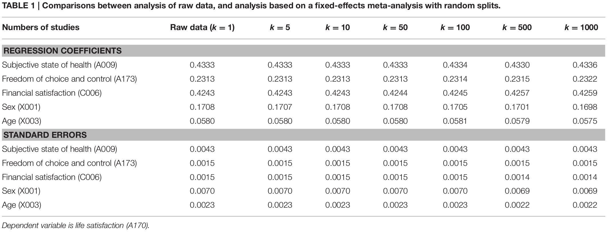

# Data preparation
* Before running the analyses, we need to install some R packages and download the data. The analyses should run fine in computer systems with at least 4GB RAM.

## Preparing the dataset
* The dataset is available at http://www.worldvaluessurvey.org/WVSDocumentationWVL.jsp. Users are required to register before downloading the data.
* In this illustration, we use the dataset in the R format (`WVS_Longitudinal_1981-2014_rdata_v_2015_04_18.zip`).
* The dataset contains data from 343,309 participants on 1,377 variables spanning across 100 regions and 6 waves (1981-1984, 1990-1994, 1995-1998, 1999-2004, 2005-2009, and 2010-2014).
* The sizes of the data in hard disk and in RAM are 1,389 MB and 1,821 MB, respectively.
* The latest version of the data may be slightly different from that used in this illustration.
* The following R code is used to read and clean up the data. The final data set is named `WVS.Rdata` for ease of manipulations.
* As an illustration, we only used 25% of the original data in this workshop.
```{r, eval=FALSE}
## You don't need to download the data. The data are stored in "WVS.Rdata"

library(dplyr)

## Unzip the downloaded file
unzip("WVS_Longitudinal_1981-2014_rdata_v_2015_04_18.zip")

## Load the data into R
load("WVS_Longitudinal_1981_2014_R_v2015_04_18.rdata")

## Display the size of the dataset
print(object.size(x=lapply(ls(), get)), units="Mb")

## 1895.3 Mb

## Rename the object for ease of data analyses
WVS <- `WVS_Longitudinal_1981_2014_R_v2015_04_18`

## Remove the old one to clean up memory
rm("WVS_Longitudinal_1981_2014_R_v2015_04_18")

## Set seed for reproducibility
set.seed(391373)

# Randomly select 25% of the data for the workshop
size <- 0.25

# Select 25% of the data
WVS <- WVS %>% group_by(S002, S003) %>% sample_frac(size=size) 

## Save the data so that we do not need to read it from raw data again
save(WVS, file="WVS.Rdata")
```

# Multiple regression
* In this section, we illustrate how to fit a regression model with both random split and stratified split.

## Random split: Fixed-effects meta-analysis
* We randomly split the data into *k*=100 *studies*.
* We regress *satisfaction with your life* (A170) on *subjective state of health* (A009), *freedom of choice and control* (A173), *satisfaction with fiNAcial situation of household* (C006), *sex* (X001), and *age* (X003) in each *study*.
* The following figure displays the regression model.

```{r, echo=FALSE, message=FALSE, purl=FALSE}
library(metaSEM)
library(semPlot)
library(lavaan)

my.model <- "A170~y1*A009+y2*A173+y3*C006+y4*X001+y5*X003"
plot(my.model)
```

* The estimated regression coefficients are treated as effect sizes for a multivariate fixed-effects meta-analysis.
* The variables used in this demonstration are:
    + *State of health (subjective)* (A009): 1 (Very good); 4 (Very poor) (it is reversed before the analyses)
    + *Satisfaction with your life* (A170): 1 (Dissatisfied); 10 (Satisfied)
    + *How much freedom of choice and control* (A173): 1 (None at all); 10 (A great deal)
    + *Satisfaction with fiNAcial situation of household* (C006): 1 (None at all); 10 (A great deal)
    + *Sex* (X001): 1 (Male); 2 (Female)
    + *Age* (X003)
    + Negative values in the original dataset represent missing values. They are recoded into missing values (NA) before the analysis.
```{r, message=FALSE, cache=FALSE}
## Load the libraries
library(dplyr)
library(lavaan)
library(metaSEM)

## Try to use multiple cores in OpenMx. It may speed up some of the analyses.
mxOption(NULL, 'Number of Threads', (parallel::detectCores()-1))

## Load the data
load("WVS.Rdata")

## Select the relevant variables to minimize the memory usage
WVS <- select(WVS, c(A009, A170, A173, C006, X001, X003, S002, S003))

## Data cleaning
## Reverse coding for A009
## Recode all negative values as NA
## Age (X003) is divided by 10 to improve numerical stability.
WVS <- mutate(WVS,
              A009 = 5-ifelse(A009 < 0, yes=NA, no=A009),
              A170 =   ifelse(A170 < 0, yes=NA, no=A170),
              A173 =   ifelse(A173 < 0, yes=NA, no=A173),
              C006 =   ifelse(C006 < 0, yes=NA, no=C006),
              X001 =   ifelse(X001 < 0, yes=NA, no=X001),
              X003 =   ifelse(X003 < 0, yes=NA, no=X003/10))

## No. of studies
k <- 100

## Set seed for reproducibility
set.seed (871139100)

## Randomly split the data into 100 studies
Study <- sample(1:nrow(WVS)) %% k + 1

## Show the sample sizes in the studies
table(Study)

## Append "Study" into the dataset
WVS$Study <- Study

## Function to fit regression analysis
## y1 to y5: Regression coefficients for A009, A173, C006, X001, and X003.
## v11 to v55: Sampling covariance matrix of the parameter estimates
fun.reg <- function(dt) { fit <- try(lm(A170~A009+A173+C006+X001+X003, data=dt),
                                     silent=TRUE)

                          ## If there are errors during the analysis, it returns missing values.
                          if (is.element("try-error", class(fit))) {
                            c(y1=NA,y2=NA,y3=NA,y4=NA,y5=NA,
                              v11=NA,v21=NA,v31=NA,v41=NA,v51=NA,
                              v22=NA,v32=NA,v42=NA,v52=NA,v33=NA,
                              v43=NA,v53=NA,v44=NA,v54=NA,v55=NA)
                          } else {
                            ## Extract the regression coefficients excluding the intercept
                            y <- unname(coef(fit))
                            ## Extract the sampling covariance matrix excluding the intercept
                            v <- lav_matrix_vech(vcov(fit)[-1,-1])
                            c(y1=y[2],y2=y[3],y3=y[4],y4=y[5],y5=y[6],
                                 v11=v[1],v21=v[2],v31=v[3],v41=v[4],v51=v[5],
                                 v22=v[6],v32=v[7],v42=v[8],v52=v[9],v33=v[10],
                                 v43=v[11],v53=v[12],v44=v[13],v54=v[14],v55=v[15])
                          }
}

########## Split data by "Study" and analyze data with the fun.reg() function on each "Study"
FEM1.reg <- WVS %>% group_by(Study) %>% do(mod=(fun.reg(.)))
FEM1.reg

## Convert it into a data frame
FEM1.reg <- as.data.frame(t(sapply(FEM1.reg$mod, function(x) x)))
## Show part of the results
head(FEM1.reg)

########## Meta-analyze results with a multivariate fixed-effects meta-analysis:
########## Variance component is fixed at 0: RE.constraints=matrix(0, ncol=5, nrow=5)
FEM2.reg <- meta(y=cbind(y1,y2,y3,y4,y5),
                 v=cbind(v11,v21,v31,v41,v51,v22,v32,v42,v52,v33,v43,v53,v44,v54,v55),
                 data=FEM1.reg, RE.constraints=matrix(0, ncol=5, nrow=5),
                 model.name="Regression analysis FEM")
summary(FEM2.reg)
```

* As a comparison we also test the regression analysis on all data (*N*=`r nrow(WVS)`).
```{r, cache=FALSE}
summary( lm(A170~A009+A173+C006+X001+X003, data=WVS) )
```

* The following table shows the effects of different *k* in the full dataset.


## Stratified split: Random-effects meta-analysis
* The data are grouped according to `Wave` and `Country`. It makes more sense to run analyses by `Wave` and `Country`.
* Random-effects models are used to account for the differences in `Wave` and `Country` and mixed-effects models are also fitted by using `Wave` as a moderator.
```{r, cache=FALSE}
## Clear all objects in the work space
rm(list=ls())

## Load the data
load("WVS.Rdata")

## Sample sizes of S002 (Wave) and S003 (Country)
## Please refer to http://www.worldvaluessurvey.org/WVSDocumentationWVL.jsp
## for the country names.
table(WVS[, c("S002","S003")])

## Select the relevant variables to minimize memory usage
WVS <- select(WVS, c(A009, A170, A173, C006, X001, X003, S002, S003))

## Reverse coding for A009
## Recode all negative values as NA
## Age (X003) is divided by 10 to improve numerical stability.
WVS <- mutate(WVS,
              A009 = 5-ifelse(A009 < 0, yes=NA, no=A009),
              A170 =   ifelse(A170 < 0, yes=NA, no=A170),
              A173 =   ifelse(A173 < 0, yes=NA, no=A173),
              C006 =   ifelse(C006 < 0, yes=NA, no=C006),
              X001 =   ifelse(X001 < 0, yes=NA, no=X001),
              X003 =   ifelse(X003 < 0, yes=NA, no=X003/10))
```

* We conduct the same regression analysis in each `Wave` and `Country`.
```{r, cache=FALSE}
## Function to fit regression model
## y1 to y5: Regression coefficients from A170, A009, A173, C006, X001, and X003.
## v11 to v55: Sampling covariance matrix of the parameter estimates
fun.reg <- function(dt) { fit <- try(lm(A170~A009+A173+C006+X001+X003, data=dt), silent=TRUE)

                          ## If there are errors during the analysis, it returns missing values.
                          if (is.element("try-error", class(fit))) {
                              c(y1=NA,y2=NA,y3=NA,y4=NA,y5=NA,
                                v11=NA,v21=NA,v31=NA,v41=NA,v51=NA,
                                v22=NA,v32=NA,v42=NA,v52=NA,v33=NA,
                                v43=NA,v53=NA,v44=NA,v54=NA,v55=NA)
                          } else {
                            ## Extract the regression coefficients excluding the intercept
                              y <- unname(coef(fit))
                              ## Extract the sampling covariance matrix excluding the intercept
                              v <- lav_matrix_vech(vcov(fit)[-1,-1])
                              c(y1=y[2],y2=y[3],y3=y[4],y4=y[5],y5=y[6],
                                v11=v[1],v21=v[2],v31=v[3],v41=v[4],v51=v[5],
                                v22=v[6],v32=v[7],v42=v[8],v52=v[9],v33=v[10],
                                v43=v[11],v53=v[12],v44=v[13],v54=v[14],v55=v[15])
                          }
}

########## Split data by Wave and Country and analyze with the fun.reg() function
## Set Wave and Country as key variables for fast reference
## S002: Wave (1 to 6)
## S003: Country
REM1.reg <- WVS %>% group_by(S002, S003) %>% do(mod=(fun.reg(.)))

## Convert it into a data frame and append S002 in the dataset
REM1.reg <- data.frame(S002=REM1.reg$S002,
                       as.data.frame(t(sapply(REM1.reg$mod, function(x) x))))

## Show part of the results
head(REM1.reg)

########## Meta-analyze results with a mixed-effects meta-analysis by using "Wave"" as a predictor
RE.constraints <- Diag(paste(0.1, "*Tau2_", 1:5, "_", 1:5, sep = ""))
REM2.reg <- meta(y=cbind(y1,y2,y3,y4,y5),
                   v=cbind(v11,v21,v31,v41,v51,v22,v32,v42,v52,v33,v43,v53,v44,v54,v55),
                   data=REM1.reg,
                   model.name="Regression analysis REM")
## Rerun the analysis to remove error code
# REM2.reg <- rerun(REM2.reg)
summary(REM2.reg)
```

* `Wave` is used as a moderator in predicting the estimated regression coefficients (effect sizes).
```{r}
## Set the first wave as 0
REM1.reg$S002 <- REM1.reg$S002-1

REM3.reg <- meta(y=cbind(y1,y2,y3,y4,y5),
                 v=cbind(v11,v21,v31,v41,v51,v22,v32,v42,v52,v33,v43,v53,v44,v54,v55),
                 x=S002, data=REM1.reg,
                 model.name="Wave as a moderator")
## Rerun the analysis to remove error code
# REM2.reg <- rerun(REM2.reg)
summary(REM3.reg)
```

# Mediation analysis
* A mediation model is fitted by using *satisfaction with your life* (A170), *freedom of choice and control* (A173), and *subjective state of health* (A009) as the dependent variable, the mediator, and the predictor, respectively.
* The following figure displays the mediation model.

```{r, echo=FALSE, message=FALSE}
library(metaSEM)
my.model <- "A170 ~ b*A173 + c*A009
             A173 ~ a*A009"
plot(my.model)
```

```{r, results='hide', cache=FALSE}
## Function to fit a mediation model using sem() function in lavaan,
## where the path coefficients are labelled with "a", "b", and "c."
## y1 and y2: indirect (a*b) and direct effects (c)
## v11, v21, and v22: Sampling covariance matrix of the indirect and direct effects
fun.med <- function(dt) { model.med <- 'A170 ~ b*A173 + c*A009
                                        A173 ~ a*A009
                                        indirect := a*b
                                        direct := c'

                          ## If there are errors during the analysis, it returns missing values.
                          fit <- try(sem(model.med, data=dt), silent=TRUE)

                          if (is.element("try-error", class(fit))) {
                             c(y1=NA,y2=NA,v11=NA,v21=NA,v22=NA)
                          } else {
                             ## y: indirect effect and direct effect
                             y <- unname(fit@Model@def.function(.x.=fit@Fit@x))
                             ## x: all parameter estimates
                             x <- fit@Fit@x
                             ## Variance covariance matrix of the parameter estimates
                             VCOV <- vcov(fit)
                             ## Compute the jacobian for 'defined parameters'
                             JAC <- lavaan:::lavJacobianD(func=fit@Model@def.function, x=x)
                             ## Compute the sampling covariance matrix using delta method
                             v <- JAC %*% VCOV %*% t(JAC)
                             c(y1=y[1],y2=y[2],v11=v[1,1],v21=v[2,1],v22=v[2,2]) 
                         }
}

########## Split data by Wave and Country and analyze with the fun.med() function
REM1.med <- WVS %>% group_by(S002, S003) %>% do(mod=(fun.med(.)))
```

```{r, cache=FALSE}
REM1.med <- data.frame(S002=REM1.med$S002,
                       as.data.frame(t(sapply(REM1.med$mod, function(x) x))))
## Show part of the results
head(REM1.med)

########## Meta-analyze results with a random-effects meta-analysis
REM2.med <- meta(y=cbind(y1,y2), v=cbind(v11,v21,v22), data=REM1.med,
                 model.name="Mediation analysis REM")
summary(REM2.med)
```

* The following plot shows a multivariate generalization of the average effect size and its 95% confidence interval in univariate meta-analysis.
    + The black dots and the black dashed ellipses are the observed effect sizes and their 95% confidence ellipses in the primary studies.
    + The blue diamond represents the estimated average population effect sizes, while the red ellipse is the 95% confidence
ellipse of estimated population average effect sizes.
    + The green ellipse is the 95% confidence ellipse of the random effects. Ninety-five percent of the studies with average population effect sizes falls inside this confidence ellipse in the long run.

```{r, fig.wide=8, fig.height=8, warning=FALSE, cache=FALSE, eval=FALSE, echo=FALSE, purl=FALSE}
postscript("fig2b.eps", horizontal=FALSE, paper="special", height=8, width=8)
plot(REM2.med, main="Multivariate meta-analysis",
     axis.label=c("Indirect effect", "Direct effect"),
     study.min.cex=0.6, randeff.ellipse.lty=2,
     randeff.ellipse.lwd=3)
dev.off()
```

```{r, fig.wide=8, fig.height=8, cache=FALSE}
plot(REM2.med, main="Multivariate meta-analysis",
     axis.label=c("Indirect effect", "Direct effect"),
     study.min.cex=0.6, randeff.ellipse.lty=2,
     randeff.ellipse.lwd=3)
```

```{r, cache=FALSE}
########## Meta-analyze results with a mixed-effects meta-analysis
## by using "Wave" (S002) as a predictor
REM3.med <- meta(y=cbind(y1,y2), v=cbind(v11,v21,v22), x=S002, data=REM1.med,
                 model.name="Mediation analysis REM")
summary(REM3.med)
```

# Confirmatory factor analysis
* The data are grouped according to `Wave` and `Country`.
* Random-effects models are used to account for the differences in `Wave` and `Country`.
* Items used in the analysis:
    + *Justifiable: claiming government benefits to which you are not entitled* (F114)
    + *Justifiable: avoiding a fare on public transport* (F115)
    + *Justifiable: cheating on taxes* (F116)
    + *Justifiable: someone accepting a bribe in the course of their duties* (F117)
    + 1 (Never justifiable) to 10 (Always justifiable); negative values represent missing values. They were recoded into missing values before the analysis.
```{r, cache=FALSE}
## Clear all objects in the work space
rm(list=ls())

## Load the data
load("WVS.Rdata")

## Select the relevant variables to minimize memory usage
WVS <- select(WVS, c(F114, F115, F116, F117, S002, S003))

## Reverse coding for A009
## Recode all negative values as NA
## Recode all negative values as NA
WVS <- mutate(WVS,
              F114 = ifelse(F114 < 0, yes=NA, no=F114),
              F115 = ifelse(F115 < 0, yes=NA, no=F115),
              F116 = ifelse(F116 < 0, yes=NA, no=F116),
              F117 = ifelse(F117 < 0, yes=NA, no=F117))
```

## Confirmatory factor analysis using the TSSEM approach
* We estimate the correlation matrix in each `Wave` and `Country`.
* The correlation matrices are used to fit a one-factor confirmatory factor analysis with the random-effects two-stage structural equation modeling (TSSEM) approach.
```{r, warning=FALSE, message=FALSE, cache=FALSE}
## Function to extract correlation matrix and sample sizes
## c21 to c43: Correlation matrix based on pairwise deletion among F114, F115, F116, and F117.
## n: Sample size based on the harmonic mean of the sample sizes in the correlation coefficients.
fun.cor <- function(dt) { ## Calculate the correlation matrix with pairwise deletion
                         my.dt <- dt[, c("F114", "F115", "F116", "F117")] 
    fit <- try(suppressWarnings(cor(my.dt, use="pairwise.complete.obs")), silent=TRUE)

                          ## Calculate the sample sizes based on harmonic mean
                          na.n <- t(!is.na(my.dt)) %*% !is.na(my.dt)
                          pairwise.n <- na.n[lower.tri(na.n)]
                          pairwise.n[pairwise.n==0] <- NA
                          ## harmonic mean
                          n <- as.integer(1/mean(1/pairwise.n, na.rm=TRUE))

                          if (is.element("try-error", class(fit))) {
                            c(c21=NA,c31=NA,c41=NA,c32=NA,
                                 c42=NA,c43=NA,n=NA)
                          } else {
                            ## regression coefficients excluding the intercept
                            c(c21=fit[2,1],c31=fit[3,1],c41=fit[4,1],
                                 c32=fit[3,2],c42=fit[4,2],c43=fit[4,3],n=n)
                          }
}

########## Split data by Wave and Country and extract the correlation matrices
########## and sample size with the fun.cor() function
stage0.cor <- WVS %>% group_by(S002, S003) %>% do(mod=(fun.cor(.)))

## Split the data into a list for ease of data analyses
data.splitted <- split(stage0.cor$mod, 1:nrow(stage0.cor))
head(data.splitted)

## Convert correlation coefficients into correlation matrices
data.cor <- lapply(data.splitted, function(x) vec2symMat(unlist(x)[1:6], diag=FALSE) )

## Extract the sample sizes
data.n <- sapply(data.splitted, function(x) unlist(x)[7])

## Remove groups without any data (n)
index.na <- is.na(data.n)
data.n <- data.n[!index.na]
data.cor <- data.cor[!index.na]

########## Meta-analyze results with the TSSEM random-effects model
REM1.cfa <- tssem1(data.cor, data.n, method="REM", RE.type="Diag",
                   model.name="One factor model REM")
## Rerun the analysis to remove error code
## REM1.cfa <- rerun(REM1.cfa)
summary(REM1.cfa)

## Show the pooled correlation matrix
vec2symMat(coef(REM1.cfa, select="fixed"), diag=FALSE)

## Show the variance components of the random effects
Diag(coef(REM1.cfa, select="random"))

## Setup a one-factor CFA model
cfa.model <- "Fraud =~ F114 + F115 + F116 + F117"
plot(cfa.model)

## Convert it into RAM formulation
RAM <- lavaan2RAM(cfa.model, obs.variables = c("F114","F115","F116","F117"))
RAM

########## Fit a one-factor CFA model on the average correlation matrix
REM2.cfa <- tssem2(REM1.cfa, Amatrix=RAM$A, Smatrix=RAM$S, Fmatrix=RAM$F, 
                   model.name="One factor model REM Stage 2 analysis")
summary(REM2.cfa)

plot(REM2.cfa, manNames=c("F114","F115","F116","F117"), latNames="Fraud",
     color="yellow")
```


# Reliability analysis
* The coefficient alpha and its sampling variance are estimated in each `Wave` and `Country`.
* Random- and mixed-effects meta-analyses are tested.
```{r, cache=FALSE}
## Function to extract coefficient alpha and its sampling variance
## y: estimated coefficient alpha
## v: sampling variance of coefficient alpha
fun.rel <- function(dt) { my.dt <- dt[, c("F114", "F115", "F116", "F117")]
                          Cov <- try(cov(my.dt,
                                         use="pairwise.complete.obs"), silent=TRUE)
                          na.n <- t(!is.na(my.dt)) %*% !is.na(my.dt)
                          pairwise.n <- na.n[lower.tri(na.n, diag=TRUE)]
                          pairwise.n[pairwise.n==0] <- NA
                          ## harmonic mean
                          n <- as.integer(1/mean(1/pairwise.n, na.rm=TRUE))

                          if (is.element("try-error", class(Cov))) {
                            c(y=NA,v=NA)
                          } else {
                            if (any(is.na(Cov))) {
                              c(y=NA,v=NA)
                            } else {
                              ## no. of items
                              q <- ncol(Cov)
                              var.item <- sum(diag(Cov))
                              var.scale <- sum(Cov)
                              ## y: coefficient alpha
                              y <- q*(1-var.item/var.scale)/(q-1)
                              ## Bonett (2010, Eq.5)
                              ## v: sampling variance of y (Bonett, 2010, Eq. 5)
                              v <- 2*q*(1-y)^2/((q-1)*(n-2))
                              c(y=y,v=v)
                            }
                          }
}

########## Split data by Wave and Country and analyze data with the fun.rel() function
REM1.rel <- WVS %>% group_by(S002, S003) %>% do(mod=(fun.rel(.)))

## Adjust the scale so that Wave 1 is S002=0.
REM1.rel <- data.frame(S002=REM1.rel$S002-1,
                       as.data.frame(t(sapply(REM1.rel$mod, function(x) x))))
head(REM1.rel)

########## Meta-analyze results with a random-effects meta-analysis by using "Wave"" as a predictor
REM2.rel <- meta(y=y, v=v, x=S002, data=REM1.rel,
                 model.name="Reliability generalization REM")
summary(REM2.rel)
```

# Settings of the R system
```{r}
sessionInfo()
```
