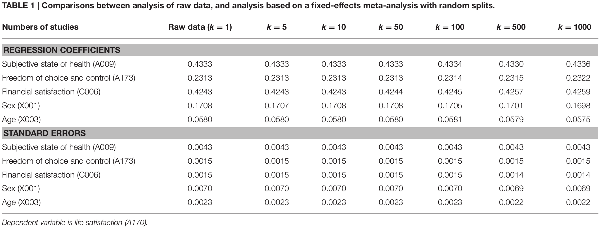
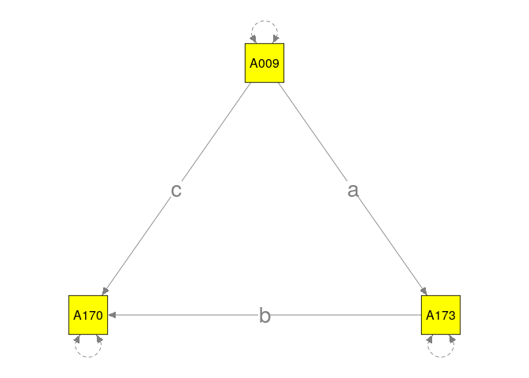

# Preparing the dataset
* The dataset is available at http://www.worldvaluessurvey.org/WVSDocumentationWVL.jsp. Users are required to register before they can download the data.
* In this illustration, we will use the dataset in the R format (`WVS_Longitudinal_1981-2014_rdata_v_2015_04_18.zip`).
* The dataset contains data from 343,309 participants on 1,377 variables spanning across 100 regions and 6 waves (1981-1984, 1990-1994, 1995-1998, 1999-2004, 2005-2009, and 2010-2014).
* The sizes of the data in hard disk and RAM are 1,389 MB and 1,821 MB, respectively.
* The following R code is used to read and clean up the data. The final data set is named `WVS.Rdata` for ease of analyses.
* As an illustration, we only used 25% of the original data in this workshop.

```r
## You don't need to download the data. The data are stored in "WVS.Rdata"

library(dplyr)

## Unzip the downloaded file
unzip("WVS_Longitudinal_1981-2014_rdata_v_2015_04_18.zip")

## Load the data into R
load("WVS_Longitudinal_1981_2014_R_v2015_04_18.rdata")

## Display the size of the dataset
print(object.size(x=lapply(ls(), get)), units="Mb")

## 1895.3 Mb

## Rename the object for ease of data analyses
WVS <- `WVS_Longitudinal_1981_2014_R_v2015_04_18`

## Remove the old one to clean up memory
rm("WVS_Longitudinal_1981_2014_R_v2015_04_18")

## Set seed for reproducibility
set.seed(391373)

# Randomly select 25% of the data for the workshop
size <- 0.25

## Group by S002 (Wave) and S003 (Region)
## Select 25% of the data
WVS <- WVS %>% group_by(S002, S003) %>% sample_frac(size=size) 

## Save the data so that we do not need to read it from raw data again
save(WVS, file="WVS.Rdata")
```

# Multiple regression
* In this section, we illustrate how to fit a regression model with both a random split and stratified split.

## Random split: Fixed-effects meta-analysis
* We randomly split the data into *k*=100 *studies*.
* We regress *satisfaction with your life* (A170) on the *subjective state of health* (A009), *freedom of choice and control* (A173), *satisfaction with finacial situation of household* (C006), *sex* (X001), and *age* (X003) in each *study*.
* The following figure displays the regression model.

<!-- -->

* The estimated regression coefficients are treated as the effect sizes for a multivariate fixed-effects meta-analysis.
* The variables used in this demonstration are:
    + *State of health (subjective)* (A009): 1 (Very good) to 4 (Very poor) (it is reversed before the analyses)
    + *Satisfaction with your life* (A170): 1 (Dissatisfied) to 10 (Satisfied)
    + *How much freedom of choice and control* (A173): 1 (None =at all) to 10 (A great deal)
    + *Satisfaction with finacial situation of household* (C006): 1 (None at all) to 10 (A great deal)
    + *Sex* (X001): 1 (Male) and 2 (Female)
    + *Age* (X003)
* **Note**. Negative values in the original dataset represent missing values. They are recoded into missing values (NA) before the analysis.

```r
## Load the libraries
library(dplyr)
library(lavaan)
library(metaSEM)

## Try to use multiple cores in OpenMx. It may speed up some of the analyses.
mxOption(NULL, 'Number of Threads', (parallel::detectCores()-1))

## Load the data
load("WVS.Rdata")

## Select the relevant variables to minimize the memory usage
WVS <- select(WVS, c(A009, A170, A173, C006, X001, X003, S002, S003))

## Data cleaning
## Reverse coding for A009
## Recode all negative values as NA
## Age (X003) is divided by 10 to improve the numerical stability.
WVS <- mutate(WVS,
              A009 = 5-ifelse(A009 < 0, yes=NA, no=A009),
              A170 =   ifelse(A170 < 0, yes=NA, no=A170),
              A173 =   ifelse(A173 < 0, yes=NA, no=A173),
              C006 =   ifelse(C006 < 0, yes=NA, no=C006),
              X001 =   ifelse(X001 < 0, yes=NA, no=X001),
              X003 =   ifelse(X003 < 0, yes=NA, no=X003/10))

## No. of pseudo studies
k <- 100

## Set seed for reproducibility
set.seed (871139100)

## Randomly split the data into 100 studies
Study <- sample(1:nrow(WVS)) %% k + 1

## Show the sample sizes in the studies
table(Study)
```

```
## Study
##   1   2   3   4   5   6   7   8   9  10  11  12  13  14  15  16  17  18 
## 853 854 854 854 854 854 854 854 854 854 854 854 854 854 854 854 854 854 
##  19  20  21  22  23  24  25  26  27  28  29  30  31  32  33  34  35  36 
## 854 854 853 853 853 853 853 853 853 853 853 853 853 853 853 853 853 853 
##  37  38  39  40  41  42  43  44  45  46  47  48  49  50  51  52  53  54 
## 853 853 853 853 853 853 853 853 853 853 853 853 853 853 853 853 853 853 
##  55  56  57  58  59  60  61  62  63  64  65  66  67  68  69  70  71  72 
## 853 853 853 853 853 853 853 853 853 853 853 853 853 853 853 853 853 853 
##  73  74  75  76  77  78  79  80  81  82  83  84  85  86  87  88  89  90 
## 853 853 853 853 853 853 853 853 853 853 853 853 853 853 853 853 853 853 
##  91  92  93  94  95  96  97  98  99 100 
## 853 853 853 853 853 853 853 853 853 853
```

```r
## Append "Study" into the dataset
WVS$Study <- Study

## Function to fit the regression analysis
## y1 to y5: Regression coefficients for A009, A173, C006, X001, and X003.
## v11 to v55: Sampling covariance matrix of the parameter estimates
## try(): Run an analysis and capture the potential errors
fun.reg <- function(dt) { fit <- try(lm(A170~A009+A173+C006+X001+X003, data=dt),
                                     silent=TRUE)

                          ## If there are errors during the analysis, it returns missing values.
                          if (is.element("try-error", class(fit))) {
                            c(y1=NA,y2=NA,y3=NA,y4=NA,y5=NA,
                              v11=NA,v21=NA,v31=NA,v41=NA,v51=NA,
                              v22=NA,v32=NA,v42=NA,v52=NA,v33=NA,
                              v43=NA,v53=NA,v44=NA,v54=NA,v55=NA)
                          } else {
                            ## Extract the regression coefficients by excluding the intercept
                            y <- unname(coef(fit))
                            ## Extract the sampling covariance matrix by excluding the intercept
                            v <- vech(vcov(fit)[-1,-1])
                            c(y1=y[2],y2=y[3],y3=y[4],y4=y[5],y5=y[6],
                                 v11=v[1],v21=v[2],v31=v[3],v41=v[4],v51=v[5],
                                 v22=v[6],v32=v[7],v42=v[8],v52=v[9],v33=v[10],
                                 v43=v[11],v53=v[12],v44=v[13],v54=v[14],v55=v[15])
                          }
}

########## Split the data by "Study" and analyze data with the fun.reg() function on each "Study"
FEM1.reg <- WVS %>% group_by(Study) %>% do(mod=(fun.reg(.)))
FEM1.reg
```

```
## Source: local data frame [100 x 2]
## Groups: <by row>
## 
## # A tibble: 100 x 2
##    Study mod       
##  * <dbl> <list>    
##  1     1 <dbl [20]>
##  2     2 <dbl [20]>
##  3     3 <dbl [20]>
##  4     4 <dbl [20]>
##  5     5 <dbl [20]>
##  6     6 <dbl [20]>
##  7     7 <dbl [20]>
##  8     8 <dbl [20]>
##  9     9 <dbl [20]>
## 10    10 <dbl [20]>
## # ... with 90 more rows
```

```r
## Convert it into a data frame
FEM1.reg <- as.data.frame(t(sapply(FEM1.reg$mod, function(x) x)))
## Show part of the results
head(FEM1.reg)
```

```
##          y1        y2        y3          y4          y5         v11
## 1 0.3526993 0.2425065 0.4033978  0.14663873 0.004164345 0.007924594
## 2 0.3026794 0.2518927 0.4516960  0.36114637 0.061712500 0.007141292
## 3 0.4894006 0.1597491 0.4672462  0.11504702 0.073327890 0.007512031
## 4 0.5394011 0.2120218 0.3373632  0.15191181 0.003252391 0.007656463
## 5 0.5249442 0.2737427 0.3581568  0.34718558 0.061524585 0.008659305
## 6 0.3606600 0.2069475 0.4697034 -0.04876456 0.061752023 0.006447144
##             v21           v31           v41          v51          v22
## 1 -0.0002998163 -0.0007917086  0.0011345822 0.0011114116 0.0009883494
## 2 -0.0002443204 -0.0005292373  0.0004900731 0.0010374915 0.0008731263
## 3 -0.0001101585 -0.0006804985  0.0005981162 0.0013249603 0.0009080059
## 4 -0.0003298679 -0.0006316297  0.0015960815 0.0012403402 0.0010110812
## 5 -0.0001112685 -0.0006860624  0.0006036919 0.0013334119 0.0011120248
## 6 -0.0001826014 -0.0006369885 -0.0003046303 0.0008098651 0.0008703068
##             v32           v42           v52          v33           v43
## 1 -0.0002256457  1.470783e-04  7.804951e-05 0.0008627651 -1.983371e-04
## 2 -0.0002029859  1.523996e-04 -4.874196e-05 0.0007804553  8.662995e-05
## 3 -0.0002338183  2.195523e-04  4.887113e-05 0.0009026357 -2.162500e-04
## 4 -0.0002856136 -2.026672e-05 -8.113721e-05 0.0008949517 -2.535262e-04
## 5 -0.0003050150  3.852758e-04  5.700844e-05 0.0009662362 -2.447986e-04
## 6 -0.0002950061  7.284879e-05 -3.170873e-05 0.0008002585 -2.561343e-05
##             v53        v44           v54         v55
## 1 -1.662081e-04 0.01976558  1.961339e-05 0.002019597
## 2 -8.099618e-05 0.01927004  1.906699e-05 0.001923564
## 3 -1.662044e-04 0.01903747  1.471553e-06 0.002211037
## 4 -1.666977e-04 0.02131495  4.131684e-04 0.002203824
## 5 -5.649461e-05 0.02242504  2.347154e-04 0.002107542
## 6 -4.333553e-05 0.01757865 -1.716555e-04 0.001742965
```

```r
########## Meta-analyze results with a multivariate fixed-effects meta-analysis:
########## Variance component is fixed at 0: RE.constraints=matrix(0, ncol=5, nrow=5)
FEM2.reg <- meta(y=cbind(y1,y2,y3,y4,y5),
                 v=cbind(v11,v21,v31,v41,v51,v22,v32,v42,v52,v33,v43,v53,v44,v54,v55),
                 data=FEM1.reg, RE.constraints=matrix(0, ncol=5, nrow=5),
                 model.name="Regression analysis FEM")
summary(FEM2.reg)
```

```
## 
## Call:
## meta(y = cbind(y1, y2, y3, y4, y5), v = cbind(v11, v21, v31, 
##     v41, v51, v22, v32, v42, v52, v33, v43, v53, v44, v54, v55), 
##     data = FEM1.reg, RE.constraints = matrix(0, ncol = 5, nrow = 5), 
##     model.name = "Regression analysis FEM")
## 
## 95% confidence intervals: z statistic approximation
## Coefficients:
##             Estimate Std.Error    lbound    ubound z value  Pr(>|z|)    
## Intercept1 0.4325550 0.0085664 0.4157651 0.4493449  50.494 < 2.2e-16 ***
## Intercept2 0.2330069 0.0030494 0.2270302 0.2389836  76.411 < 2.2e-16 ***
## Intercept3 0.4228484 0.0029012 0.4171621 0.4285347 145.748 < 2.2e-16 ***
## Intercept4 0.1602916 0.0139082 0.1330321 0.1875511  11.525 < 2.2e-16 ***
## Intercept5 0.0499660 0.0045076 0.0411314 0.0588007  11.085 < 2.2e-16 ***
## ---
## Signif. codes:  0 '***' 0.001 '**' 0.01 '*' 0.05 '.' 0.1 ' ' 1
## 
## Q statistic on the homogeneity of effect sizes: 616.6059
## Degrees of freedom of the Q statistic: 495
## P value of the Q statistic: 0.0001542828
## 
## Heterogeneity indices (based on the estimated Tau2):
##                              Estimate
## Intercept1: I2 (Q statistic)        0
## Intercept2: I2 (Q statistic)        0
## Intercept3: I2 (Q statistic)        0
## Intercept4: I2 (Q statistic)        0
## Intercept5: I2 (Q statistic)        0
## 
## Number of studies (or clusters): 100
## Number of observed statistics: 500
## Number of estimated parameters: 5
## Degrees of freedom: 495
## -2 log likelihood: -1399.871 
## OpenMx status1: 0 ("0" or "1": The optimization is considered fine.
## Other values may indicate problems.)
```

* As a comparison, we also test the regression analysis on all data (*N*=85319). The results are comparable.

```r
summary( lm(A170~A009+A173+C006+X001+X003, data=WVS) )
```

```
## 
## Call:
## lm(formula = A170 ~ A009 + A173 + C006 + X001 + X003, data = WVS)
## 
## Residuals:
##     Min      1Q  Median      3Q     Max 
## -8.8263 -1.1088  0.0771  1.1228  7.6312 
## 
## Coefficients:
##             Estimate Std. Error t value Pr(>|t|)    
## (Intercept) 0.916449   0.043967   20.84   <2e-16 ***
## A009        0.432349   0.008582   50.38   <2e-16 ***
## A173        0.232777   0.003055   76.20   <2e-16 ***
## C006        0.422188   0.002907  145.25   <2e-16 ***
## X001        0.161534   0.013938   11.59   <2e-16 ***
## X003        0.049627   0.004516   10.99   <2e-16 ***
## ---
## Signif. codes:  0 '***' 0.001 '**' 0.01 '*' 0.05 '.' 0.1 ' ' 1
## 
## Residual standard error: 1.909 on 75502 degrees of freedom
##   (9811 observations deleted due to missingness)
## Multiple R-squared:  0.3891,	Adjusted R-squared:  0.3891 
## F-statistic:  9619 on 5 and 75502 DF,  p-value: < 2.2e-16
```

* The following table shows the effects of different *k* in the **full** dataset (not the 25% used in the workshop).


## Stratified split: Random-effects meta-analysis
* The data are grouped according to `Wave` and `Country`. It may make more sense to run the analyses by `Wave` and `Country`.
* Random-effects models are used to account for the differences in `Wave` and `Country`, and mixed-effects models are also fitted by using `Wave` as a moderator.

```r
## Clear all objects in the work space
rm(list=ls())

## Load the data
load("WVS.Rdata")

## Sample sizes of S002 (Wave) and S003 (Country)
## Please refer to http://www.worldvaluessurvey.org/WVSDocumentationWVL.jsp
## for the country names.
table(WVS[, c("S002","S003")])
```

```
##     S003
## S002    8   12   20   31   32   36   48   50   51   70   76  100  112  124
##    1    0    0    0    0  251  307    0    0    0    0    0    0    0    0
##    2    0    0    0    0  250    0    0    0    0    0  446    0  254    0
##    3  250    0    0  500  270  512    0  381  500    0    0  268  523    0
##    4  250  320    0    0  320    0    0  375    0  300    0    0    0  483
##    5    0    0  251    0  250  355    0    0    0    0  375  250    0  541
##    6    0  300    0  250  258  369  300    0  275    0  372    0  384    0
##     S003
## S002  152  156  158  170  191  196  203  214  218  222  231  233  246  250
##    1    0    0    0    0    0    0    0    0    0    0    0    0  251    0
##    2  375  250    0    0    0    0  231    0    0    0    0    0    0    0
##    3  250  375  195 1506  299    0  287  104    0  314    0  255  247    0
##    4  300  250    0    0    0    0    0    0    0    0    0    0    0    0
##    5  250  498  307  756    0  262    0    0    0    0  375    0  254  250
##    6  250  575  310  378    0  250    0    0  300    0    0  383    0    0
##     S003
## S002  268  275  276  288  320  344  348  356  360  364  368  376  380  392
##    1    0    0    0    0    0    0  366    0    0    0    0    0    0  301
##    2    0    0    0    0    0    0    0  625    0    0    0    0    0  253
##    3  502    0  506    0    0    0  162  510    0    0    0    0    0  264
##    4    0    0    0    0    0    0    0  500  250  633  581  300    0  340
##    5  375    0  516  384  250  313  252  500  504  667  675    0  253  274
##    6  300  250  512  388    0  250    0  395    0    0  300    0    0  611
##     S003
## S002  398  400  410  414  417  422  428  434  440  458  466  484  498  499
##    1    0    0  242    0    0    0    0    0    0    0    0  459    0    0
##    2    0    0  313    0    0    0    0    0    0    0    0  383    0    0
##    3    0    0  312    0    0    0  300    0  252    0    0  591  246   60
##    4    0  306  300    0  261    0    0    0    0    0    0  384  252  265
##    5    0  300  300    0    0    0    0    0    0  300  384  390  262    0
##    6  375  300  300  326  375  300    0  533    0  325    0  500    0    0
##     S003
## S002  504  528  554  566  578  586  604  608  616  630  634  642  643  646
##    1    0    0    0    0    0    0    0    0    0    0    0    0    0    0
##    2    0    0    0  250    0    0    0    0  234    0    0    0  490    0
##    3    0    0  300  499  282  183  303  300  288  291    0  310  510    0
##    4  313    0    0  506    0  500  375  300    0  180    0    0    0    0
##    5  300  262  238    0  256    0  375    0  250    0    0  444  508  377
##    6  300  476  210  440    0  300  302  300  242    0  265  376  625  382
##     S003
## S002  682  688  702  703  704  705  710  716  724  752  756  764  780  788
##    1    0    0    0    0    0    0  399    0    0    0    0    0    0    0
##    2    0    0    0  116    0    0  684    0  378    0  350    0    0    0
##    3    0  320    0  274    0  252  734    0  303  252  303    0    0    0
##    4  376  300  378    0  250    0  750  250  302    0    0    0    0    0
##    5    0    0    0    0  374  259  747    0  300  251  310  384  250    0
##    6    0    0  493    0    0  267  883  375  297  302    0  300  250  301
##     S003
## S002  792  800  804  807  818  826  834  840  854  858  860  862  887  891
##    1    0    0    0    0    0    0    0    0    0    0    0    0    0    0
##    2  258    0    0    0    0    0    0    0    0    0    0    0    0    0
##    3  477    0  703  249    0  273    0  386    0  250    0  300    0    0
##    4  850  250    0  264  750    0  293  300    0    0    0  300    0    0
##    5  336    0  250    0  763  260    0  312  384  250    0    0    0  305
##    6  401    0  375    0  381    0    0  558    0  250  375    0  250    0
##     S003
## S002  894  914
##    1    0    0
##    2    0    0
##    3    0  200
##    4    0    0
##    5  375    0
##    6    0    0
```

```r
## Select the relevant variables to minimize memory usage
WVS <- select(WVS, c(A009, A170, A173, C006, X001, X003, S002, S003))

## Reverse coding for A009
## Recode all negative values as NA
## Age (X003) is divided by 10 to improve numerical stability.
WVS <- mutate(WVS,
              A009 = 5-ifelse(A009 < 0, yes=NA, no=A009),
              A170 =   ifelse(A170 < 0, yes=NA, no=A170),
              A173 =   ifelse(A173 < 0, yes=NA, no=A173),
              C006 =   ifelse(C006 < 0, yes=NA, no=C006),
              X001 =   ifelse(X001 < 0, yes=NA, no=X001),
              X003 =   ifelse(X003 < 0, yes=NA, no=X003/10))
```

* We conduct the same regression analysis in each `Wave` and `Country`.

```r
## Function to fit a regression model
## y1 to y5: Regression coefficients from A170, A009, A173, C006, X001, and X003.
## v11 to v55: Sampling covariance matrix of the parameter estimates
fun.reg <- function(dt) { fit <- try(lm(A170~A009+A173+C006+X001+X003, data=dt),
                                     silent=TRUE)

                          ## If there are errors during the analysis, it returns missing values.
                          if (is.element("try-error", class(fit))) {
                              c(y1=NA,y2=NA,y3=NA,y4=NA,y5=NA,
                                v11=NA,v21=NA,v31=NA,v41=NA,v51=NA,
                                v22=NA,v32=NA,v42=NA,v52=NA,v33=NA,
                                v43=NA,v53=NA,v44=NA,v54=NA,v55=NA)
                          } else {
                            ## Extract the regression coefficients excluding the intercept
                              y <- unname(coef(fit))
                              ## Extract the sampling covariance matrix excluding the intercept
                              v <- lav_matrix_vech(vcov(fit)[-1,-1])
                              c(y1=y[2],y2=y[3],y3=y[4],y4=y[5],y5=y[6],
                                v11=v[1],v21=v[2],v31=v[3],v41=v[4],v51=v[5],
                                v22=v[6],v32=v[7],v42=v[8],v52=v[9],v33=v[10],
                                v43=v[11],v53=v[12],v44=v[13],v54=v[14],v55=v[15])
                          }
}

########## Split the data by Wave and Country and analyze with the fun.reg() function
## Set Wave and Country as key variables for fast reference
## S002: Wave (1 to 6)
## S003: Country
REM1.reg <- WVS %>% group_by(S002, S003) %>% do(mod=(fun.reg(.)))

## Convert it into a data frame and append S002 in the dataset
REM1.reg <- data.frame(S002=REM1.reg$S002,
                       as.data.frame(t(sapply(REM1.reg$mod, function(x) x))))

## Show part of the results
head(REM1.reg)
```

```
##   S002        y1        y2        y3         y4         y5        v11
## 1    1 0.3743034 0.2328886 0.2564374 0.01550296 0.11450944 0.01941604
## 2    1 0.3527930 0.2645303 0.2345512 0.19481887 0.04228843 0.01068033
## 3    1        NA        NA        NA         NA         NA         NA
## 4    1        NA        NA        NA         NA         NA         NA
## 5    1 0.3135367 0.1556614 0.4715114 0.11473544 0.13975349 0.01742036
## 6    1        NA        NA        NA         NA         NA         NA
##             v21           v31           v41         v51         v22
## 1 -0.0003065607 -0.0012793032  0.0021055460 0.001950389 0.003805999
## 2 -0.0004808220 -0.0004593117 -0.0006025154 0.001601953 0.002284661
## 3            NA            NA            NA          NA          NA
## 4            NA            NA            NA          NA          NA
## 5 -0.0005779970 -0.0016485304  0.0022026851 0.001547690 0.002811312
## 6            NA            NA            NA          NA          NA
##             v32           v42           v52         v33          v43
## 1 -0.0013358089 -1.763644e-03 -2.543292e-04 0.003342613 8.303774e-04
## 2 -0.0004387922  4.782698e-05  4.781025e-05 0.001927222 6.810260e-04
## 3            NA            NA            NA          NA           NA
## 4            NA            NA            NA          NA           NA
## 5 -0.0006226441 -1.850632e-04  8.611607e-04 0.002372171 9.753484e-06
## 6            NA            NA            NA          NA           NA
##             v53        v44           v54         v55
## 1 -8.514012e-05 0.05691752 -6.824875e-04 0.005975045
## 2 -2.474024e-04 0.03721482  8.607615e-05 0.003707242
## 3            NA         NA            NA          NA
## 4            NA         NA            NA          NA
## 5 -5.922198e-04 0.04083653 -6.870771e-04 0.004442046
## 6            NA         NA            NA          NA
```

```r
########## Meta-analyze results with a random-effects model
REM2.reg <- meta(y=cbind(y1,y2,y3,y4,y5),
                   v=cbind(v11,v21,v31,v41,v51,v22,v32,v42,v52,
                           v33,v43,v53,v44,v54,v55),
                   data=REM1.reg,
                   model.name="Regression analysis REM")
## Rerun the analysis to remove error code
# REM2.reg <- rerun(REM2.reg)
summary(REM2.reg)
```

```
## 
## Call:
## meta(y = cbind(y1, y2, y3, y4, y5), v = cbind(v11, v21, v31, 
##     v41, v51, v22, v32, v42, v52, v33, v43, v53, v44, v54, v55), 
##     data = REM1.reg, model.name = "Regression analysis REM")
## 
## 95% confidence intervals: z statistic approximation
## Coefficients:
##               Estimate   Std.Error      lbound      ubound z value
## Intercept1  0.39999048  0.01366741  0.37320285  0.42677810 29.2660
## Intercept2  0.20793282  0.00673036  0.19474157  0.22112408 30.8948
## Intercept3  0.37794932  0.01099865  0.35639237  0.39950627 34.3633
## Intercept4  0.11396738  0.01461086  0.08533062  0.14260414  7.8002
## Intercept5  0.02484569  0.00604593  0.01299588  0.03669550  4.1095
## Tau2_1_1    0.02518781  0.00387929  0.01758454  0.03279107  6.4929
## Tau2_2_1   -0.00064214  0.00134913 -0.00328639  0.00200211 -0.4760
## Tau2_2_2    0.00781702  0.00094279  0.00596919  0.00966485  8.2914
## Tau2_3_1   -0.01010905  0.00234299 -0.01470123 -0.00551687 -4.3146
## Tau2_3_2   -0.00443283  0.00114282 -0.00667271 -0.00219296 -3.8789
## Tau2_3_3    0.02476000  0.00253878  0.01978408  0.02973591  9.7527
## Tau2_4_1   -0.00124771  0.00284230 -0.00681852  0.00432310 -0.4390
## Tau2_4_2    0.00043101  0.00141902 -0.00235022  0.00321224  0.3037
## Tau2_4_3    0.00402037  0.00239348 -0.00067076  0.00871150  1.6797
## Tau2_4_4    0.01139238  0.00417788  0.00320388  0.01958087  2.7268
## Tau2_5_1    0.00081939  0.00121931 -0.00157040  0.00320918  0.6720
## Tau2_5_2    0.00070450  0.00060605 -0.00048334  0.00189233  1.1624
## Tau2_5_3   -0.00185258  0.00100280 -0.00381802  0.00011286 -1.8474
## Tau2_5_4    0.00051500  0.00130547 -0.00204367  0.00307368  0.3945
## Tau2_5_5    0.00364193  0.00078704  0.00209935  0.00518451  4.6274
##             Pr(>|z|)    
## Intercept1 < 2.2e-16 ***
## Intercept2 < 2.2e-16 ***
## Intercept3 < 2.2e-16 ***
## Intercept4 6.217e-15 ***
## Intercept5 3.965e-05 ***
## Tau2_1_1   8.420e-11 ***
## Tau2_2_1   0.6340983    
## Tau2_2_2   2.220e-16 ***
## Tau2_3_1   1.599e-05 ***
## Tau2_3_2   0.0001049 ***
## Tau2_3_3   < 2.2e-16 ***
## Tau2_4_1   0.6606778    
## Tau2_4_2   0.7613293    
## Tau2_4_3   0.0930118 .  
## Tau2_4_4   0.0063945 ** 
## Tau2_5_1   0.5015753    
## Tau2_5_2   0.2450564    
## Tau2_5_3   0.0646869 .  
## Tau2_5_4   0.6932142    
## Tau2_5_5   3.704e-06 ***
## ---
## Signif. codes:  0 '***' 0.001 '**' 0.01 '*' 0.05 '.' 0.1 ' ' 1
## 
## Q statistic on the homogeneity of effect sizes: 5820.788
## Degrees of freedom of the Q statistic: 1105
## P value of the Q statistic: 0
## 
## Heterogeneity indices (based on the estimated Tau2):
##                              Estimate
## Intercept1: I2 (Q statistic)   0.6309
## Intercept2: I2 (Q statistic)   0.7989
## Intercept3: I2 (Q statistic)   0.9310
## Intercept4: I2 (Q statistic)   0.2487
## Intercept5: I2 (Q statistic)   0.4739
## 
## Number of studies (or clusters): 238
## Number of observed statistics: 1110
## Number of estimated parameters: 20
## Degrees of freedom: 1090
## -2 log likelihood: -1163.962 
## OpenMx status1: 0 ("0" or "1": The optimization is considered fine.
## Other values may indicate problems.)
```

* `Wave` is used as a moderator in predicting the estimated regression coefficients (effect sizes).

```r
## Set the first wave as 0
REM1.reg$S002 <- REM1.reg$S002-1

REM3.reg <- meta(y=cbind(y1,y2,y3,y4,y5),
                 v=cbind(v11,v21,v31,v41,v51,v22,v32,v42,v52,v33,v43,v53,v44,v54,v55),
                 x=S002, data=REM1.reg,
                 model.name="Wave as a moderator")
summary(REM3.reg)
```

```
## 
## Call:
## meta(y = cbind(y1, y2, y3, y4, y5), v = cbind(v11, v21, v31, 
##     v41, v51, v22, v32, v42, v52, v33, v43, v53, v44, v54, v55), 
##     x = S002, data = REM1.reg, model.name = "Wave as a moderator")
## 
## 95% confidence intervals: z statistic approximation
## Coefficients:
##               Estimate   Std.Error      lbound      ubound z value
## Intercept1  2.3434e-01  3.5131e-02  1.6548e-01  3.0320e-01  6.6704
## Intercept2  2.2886e-01  1.8379e-02  1.9284e-01  2.6488e-01 12.4525
## Intercept3  4.6785e-01  2.9323e-02  4.1038e-01  5.2533e-01 15.9550
## Intercept4  1.7776e-01  4.0545e-02  9.8297e-02  2.5723e-01  4.3844
## Intercept5  7.0163e-02  1.6488e-02  3.7847e-02  1.0248e-01  4.2554
## Slope1_1    4.8823e-02  9.6521e-03  2.9905e-02  6.7741e-02  5.0583
## Slope2_1   -6.1178e-03  5.0390e-03 -1.5994e-02  3.7585e-03 -1.2141
## Slope3_1   -2.6448e-02  8.0228e-03 -4.2172e-02 -1.0724e-02 -3.2966
## Slope4_1   -1.8623e-02  1.0999e-02 -4.0180e-02  2.9342e-03 -1.6932
## Slope5_1   -1.3165e-02  4.4661e-03 -2.1919e-02 -4.4118e-03 -2.9478
## Tau2_1_1    2.0708e-02  3.4568e-03  1.3933e-02  2.7483e-02  5.9905
## Tau2_2_1   -1.4472e-04  1.2663e-03 -2.6265e-03  2.3371e-03 -0.1143
## Tau2_2_2    7.7658e-03  9.3595e-04  5.9314e-03  9.6002e-03  8.2973
## Tau2_3_1   -7.7585e-03  2.1376e-03 -1.1948e-02 -3.5688e-03 -3.6295
## Tau2_3_2   -4.7208e-03  1.1235e-03 -6.9228e-03 -2.5188e-03 -4.2019
## Tau2_3_3    2.3506e-02  2.4227e-03  1.8757e-02  2.8254e-02  9.7023
## Tau2_4_1    5.9675e-04  2.6685e-03 -4.6334e-03  5.8269e-03  0.2236
## Tau2_4_2    2.4146e-04  1.3981e-03 -2.4988e-03  2.9818e-03  0.1727
## Tau2_4_3    3.0928e-03  2.3246e-03 -1.4633e-03  7.6489e-03  1.3305
## Tau2_4_4    1.0586e-02  4.1093e-03  2.5322e-03  1.8641e-02  2.5762
## Tau2_5_1    1.9366e-03  1.1512e-03 -3.1968e-04  4.1929e-03  1.6823
## Tau2_5_2    5.6726e-04  5.9316e-04 -5.9532e-04  1.7298e-03  0.9563
## Tau2_5_3   -2.4896e-03  9.7508e-04 -4.4007e-03 -5.7845e-04 -2.5532
## Tau2_5_4    5.0033e-05  1.2686e-03 -2.4363e-03  2.5364e-03  0.0394
## Tau2_5_5    3.4228e-03  7.5682e-04  1.9394e-03  4.9061e-03  4.5226
##             Pr(>|z|)    
## Intercept1 2.551e-11 ***
## Intercept2 < 2.2e-16 ***
## Intercept3 < 2.2e-16 ***
## Intercept4 1.163e-05 ***
## Intercept5 2.087e-05 ***
## Slope1_1   4.231e-07 ***
## Slope2_1   0.2247171    
## Slope3_1   0.0009787 ***
## Slope4_1   0.0904199 .  
## Slope5_1   0.0032005 ** 
## Tau2_1_1   2.092e-09 ***
## Tau2_2_1   0.9090054    
## Tau2_2_2   < 2.2e-16 ***
## Tau2_3_1   0.0002840 ***
## Tau2_3_2   2.647e-05 ***
## Tau2_3_3   < 2.2e-16 ***
## Tau2_4_1   0.8230445    
## Tau2_4_2   0.8628860    
## Tau2_4_3   0.1833590    
## Tau2_4_4   0.0099898 ** 
## Tau2_5_1   0.0925166 .  
## Tau2_5_2   0.3389039    
## Tau2_5_3   0.0106740 *  
## Tau2_5_4   0.9685395    
## Tau2_5_5   6.110e-06 ***
## ---
## Signif. codes:  0 '***' 0.001 '**' 0.01 '*' 0.05 '.' 0.1 ' ' 1
## 
## Q statistic on the homogeneity of effect sizes: 5820.788
## Degrees of freedom of the Q statistic: 1105
## P value of the Q statistic: 0
## 
## Explained variances (R2):
##                               y1        y2        y3        y4     y5
## Tau2 (no predictor)    0.0251878 0.0078170 0.0247600 0.0113924 0.0036
## Tau2 (with predictors) 0.0207082 0.0077658 0.0235059 0.0105864 0.0034
## R2                     0.1778493 0.0065503 0.0506511 0.0707483 0.0602
## 
## Number of studies (or clusters): 238
## Number of observed statistics: 1110
## Number of estimated parameters: 25
## Degrees of freedom: 1085
## -2 log likelihood: -1213.661 
## OpenMx status1: 0 ("0" or "1": The optimization is considered fine.
## Other values may indicate problems.)
```

# Mediation analysis
* A mediation model is fitted by using *satisfaction with your life* (A170), *freedom of choice and control* (A173), and *subjective state of health* (A009) as the dependent variable, the mediator, and the predictor, respectively.
* The following figure displays the mediation model.

<!-- -->


```r
## Function to fit a mediation model using sem() function in lavaan,
## where the path coefficients are labelled with "a", "b", and "c."
## y1 and y2: indirect (a*b) and direct effects (c)
## v11, v21, and v22: Sampling covariance matrix of the indirect and direct effects
fun.med <- function(dt) { model.med <- 'A170 ~ b*A173 + c*A009
                                        A173 ~ a*A009
                                        indirect := a*b
                                        direct := c'

                          ## If there are errors during the analysis, it returns missing values.
                          fit <- try(sem(model.med, data=dt), silent=TRUE)

                          if (is.element("try-error", class(fit))) {
                             c(y1=NA,y2=NA,v11=NA,v21=NA,v22=NA)
                          } else {
                             ## y: indirect effect and direct effect
                             y <- unname(fit@Model@def.function(.x.=fit@Fit@x))
                             ## x: all parameter estimates
                             x <- fit@Fit@x
                             ## Variance covariance matrix of the parameter estimates
                             VCOV <- vcov(fit)
                             ## Compute the jacobian for 'defined parameters'
                             JAC <- lavaan:::lavJacobianD(func=fit@Model@def.function, x=x)
                             ## Compute the sampling covariance matrix using delta method
                             v <- JAC %*% VCOV %*% t(JAC)
                             c(y1=y[1],y2=y[2],v11=v[1,1],v21=v[2,1],v22=v[2,2]) 
                         }
}

########## Split the data by Wave and Country and analyze with the fun.med() function
REM1.med <- WVS %>% group_by(S002, S003) %>% do(mod=(fun.med(.)))
```


```r
REM1.med <- data.frame(S002=REM1.med$S002,
                       as.data.frame(t(sapply(REM1.med$mod, function(x) x))))
## Show part of the results
head(REM1.med)
```

```
##   S002         y1        y2         v11           v21        v22
## 1    1 0.06810676 0.4228824 0.003375352 -1.278731e-04 0.01919673
## 2    1 0.07853920 0.3859683 0.001522697 -1.613484e-04 0.01084408
## 3    1 0.09810821 0.3060317 0.001129751 -6.344512e-04 0.00873114
## 4    1 0.22216168 0.5222645 0.003064635 -1.288170e-03 0.01760870
## 5    1 0.14066235 0.5908384 0.002615358 -1.085113e-03 0.02181406
## 6    1 0.06292103 0.2625921 0.003828095 -8.457642e-05 0.01799829
```

```r
########## Meta-analyze results with a random-effects meta-analysis
REM2.med <- meta(y=cbind(y1,y2), v=cbind(v11,v21,v22), data=REM1.med,
                 model.name="Mediation analysis REM")
summary(REM2.med)
```

```
## 
## Call:
## meta(y = cbind(y1, y2), v = cbind(v11, v21, v22), data = REM1.med, 
##     model.name = "Mediation analysis REM")
## 
## 95% confidence intervals: z statistic approximation
## Coefficients:
##               Estimate   Std.Error      lbound      ubound z value
## Intercept1  0.11928726  0.00600192  0.10752371  0.13105081 19.8748
## Intercept2  0.57087281  0.01579004  0.53992489  0.60182073 36.1540
## Tau2_1_1    0.00516394  0.00074847  0.00369697  0.00663091  6.8994
## Tau2_2_1    0.00115178  0.00137208 -0.00153744  0.00384100  0.8394
## Tau2_2_2    0.03902859  0.00534163  0.02855918  0.04949800  7.3065
##             Pr(>|z|)    
## Intercept1 < 2.2e-16 ***
## Intercept2 < 2.2e-16 ***
## Tau2_1_1   5.224e-12 ***
## Tau2_2_1      0.4012    
## Tau2_2_2   2.742e-13 ***
## ---
## Signif. codes:  0 '***' 0.001 '**' 0.01 '*' 0.05 '.' 0.1 ' ' 1
## 
## Q statistic on the homogeneity of effect sizes: 2199.813
## Degrees of freedom of the Q statistic: 454
## P value of the Q statistic: 0
## 
## Heterogeneity indices (based on the estimated Tau2):
##                              Estimate
## Intercept1: I2 (Q statistic)   0.8659
## Intercept2: I2 (Q statistic)   0.7152
## 
## Number of studies (or clusters): 238
## Number of observed statistics: 456
## Number of estimated parameters: 5
## Degrees of freedom: 451
## -2 log likelihood: -435.4975 
## OpenMx status1: 0 ("0" or "1": The optimization is considered fine.
## Other values may indicate problems.)
```

* The following plot shows a multivariate generalization of the average effect size and its 95% confidence interval in the univariate meta-analysis.
    + The black dots and the black dashed ellipses are the observed effect sizes and their 95% confidence ellipses in the primary studies.
    + The blue diamond represents the estimated average population effect sizes, while the red ellipse is the 95% confidence
ellipse of estimated population average effect sizes.
    + The green ellipse is the 95% confidence ellipse of the random effects. Ninety-five percent of the studies with average population effect sizes falls inside this confidence ellipse in the long run.


```r
plot(REM2.med, main="Multivariate meta-analysis",
     axis.label=c("Indirect effect", "Direct effect"),
     study.min.cex=0.6, randeff.ellipse.lty=2,
     randeff.ellipse.lwd=3)
```

<!-- -->

* `Wave` explains about 1% and 20% of the variation of the indirect and direct effects, respectively.

```r
########## Meta-analyze results with a mixed-effects meta-analysis
## by using "Wave" (S002) as a predictor
REM3.med <- meta(y=cbind(y1,y2), v=cbind(v11,v21,v22), x=S002, data=REM1.med,
                 model.name="Mediation analysis REM")
summary(REM3.med)
```

```
## 
## Call:
## meta(y = cbind(y1, y2), v = cbind(v11, v21, v22), x = S002, data = REM1.med, 
##     model.name = "Mediation analysis REM")
## 
## 95% confidence intervals: z statistic approximation
## Coefficients:
##              Estimate  Std.Error     lbound     ubound z value  Pr(>|z|)
## Intercept1  0.1313550  0.0187280  0.0946489  0.1680612  7.0138 2.319e-12
## Intercept2  0.3041307  0.0468288  0.2123478  0.3959135  6.4945 8.330e-11
## Slope1_1   -0.0027935  0.0040723 -0.0107750  0.0051881 -0.6860    0.4927
## Slope2_1    0.0615628  0.0102651  0.0414436  0.0816821  5.9973 2.006e-09
## Tau2_1_1    0.0051026  0.0007439  0.0036446  0.0065606  6.8593 6.919e-12
## Tau2_2_1    0.0014288  0.0012631 -0.0010469  0.0039045  1.1312    0.2580
## Tau2_2_2    0.0310599  0.0045940  0.0220558  0.0400641  6.7609 1.371e-11
##               
## Intercept1 ***
## Intercept2 ***
## Slope1_1      
## Slope2_1   ***
## Tau2_1_1   ***
## Tau2_2_1      
## Tau2_2_2   ***
## ---
## Signif. codes:  0 '***' 0.001 '**' 0.01 '*' 0.05 '.' 0.1 ' ' 1
## 
## Q statistic on the homogeneity of effect sizes: 2199.813
## Degrees of freedom of the Q statistic: 454
## P value of the Q statistic: 0
## 
## Explained variances (R2):
##                               y1     y2
## Tau2 (no predictor)    0.0051639 0.0390
## Tau2 (with predictors) 0.0051026 0.0311
## R2                     0.0118740 0.2042
## 
## Number of studies (or clusters): 238
## Number of observed statistics: 456
## Number of estimated parameters: 7
## Degrees of freedom: 449
## -2 log likelihood: -469.602 
## OpenMx status1: 0 ("0" or "1": The optimization is considered fine.
## Other values may indicate problems.)
```

# Confirmatory factor analysis
* The data are grouped according to `Wave` and `Country`.
* Random-effects models are used to account for the differences in `Wave` and `Country`.
* Items used in the analysis:
    + *Justifiable: claiming government benefits to which you are not entitled* (F114)
    + *Justifiable: avoiding a fare on public transport* (F115)
    + *Justifiable: cheating on taxes* (F116)
    + *Justifiable: someone accepting a bribe in the course of their duties* (F117)
    + 1 (Never justifiable) to 10 (Always justifiable); negative values represent missing values. They were recoded into missing values before the analysis.
* We may either use the covariance or correlation matrices in the analyses:
    + **Covariance** matrix: measurement invariance
    + **Correlation** matrix: only structural relationship
* In this example, we illustrate the use of the covariance matrix estimated in each `Wave` and `Country`.
* The covariance matrices are used to fit a one-factor confirmatory factor analysis with the random-effects two-stage structural equation modeling (TSSEM) approach.


```r
## Clear all objects in the work space
rm(list=ls())

## Load the data
load("WVS.Rdata")

## Select the relevant variables to minimize memory usage
WVS <- select(WVS, c(F114, F115, F116, F117, S002, S003))

## Reverse coding for A009
## Recode all negative values as NA
## Recode all negative values as NA
WVS <- mutate(WVS,
              F114 = ifelse(F114 < 0, yes=NA, no=F114),
              F115 = ifelse(F115 < 0, yes=NA, no=F115),
              F116 = ifelse(F116 < 0, yes=NA, no=F116),
              F117 = ifelse(F117 < 0, yes=NA, no=F117))

## Function to calculate the covariance matrices and sample sizes without any missing data
fun.cov <- function(dt) { 
  my.dt <- dt[, c("F114", "F115", "F116", "F117")] 
  ## Calculate the covariance matrix based on the complete data
  Cov <- try(suppressWarnings(cov(my.dt, use="complete.obs")), silent=TRUE)
  
  ## Calculate the sample sizes based on the complete cases
  n <- length(complete.cases(my.dt))
  
  ## Return NA when there are errors
  if (is.element("try-error", class(Cov))) {
    list(Cov=NA, n=NA)
  } else {
    ## regression coefficients excluding the intercept
    list(Cov=Cov, n=n)
  }
}

########## Split the data by Wave and Country and extract the correlation matrices
########## and sample size with the fun.cor() function
stage0.cov <- WVS %>% group_by(S002, S003) %>% do(mod=(fun.cov(.)))
stage0.cov
```

```
## Source: local data frame [238 x 3]
## Groups: <by row>
## 
## # A tibble: 238 x 3
##     S002  S003 mod       
##  * <int> <int> <list>    
##  1     1    32 <list [2]>
##  2     1    36 <list [2]>
##  3     1   246 <list [2]>
##  4     1   348 <list [2]>
##  5     1   392 <list [2]>
##  6     1   410 <list [2]>
##  7     1   484 <list [2]>
##  8     1   710 <list [2]>
##  9     2    32 <list [2]>
## 10     2    76 <list [2]>
## # ... with 228 more rows
```

```r
## Extract the covariance matrices and sample sizes
data.splitted <- split(stage0.cov$mod, 1:nrow(stage0.cov))
head(data.splitted, n=2)
```

```
## $`1`
## $`1`[[1]]
## $`1`[[1]]$Cov
##           F114      F115      F116      F117
## F114 5.2401401 1.9980712 1.7036699 0.4293944
## F115 1.9980712 4.5911883 2.0575098 0.5850464
## F116 1.7036699 2.0575098 3.9884270 0.4387595
## F117 0.4293944 0.5850464 0.4387595 0.9059439
## 
## $`1`[[1]]$n
## [1] 251
## 
## 
## 
## $`2`
## $`2`[[1]]
## $`2`[[1]]$Cov
##          F114     F115     F116     F117
## F114 4.042856 2.829255 2.346508 1.720607
## F115 2.829255 4.930423 3.640250 1.580300
## F116 2.346508 3.640250 7.338892 1.626534
## F117 1.720607 1.580300 1.626534 2.324724
## 
## $`2`[[1]]$n
## [1] 307
```

```r
## A list of covariance matrices
data.cov <- lapply(data.splitted, function(x) x[[1]]$Cov)
head(data.cov, n=2)
```

```
## $`1`
##           F114      F115      F116      F117
## F114 5.2401401 1.9980712 1.7036699 0.4293944
## F115 1.9980712 4.5911883 2.0575098 0.5850464
## F116 1.7036699 2.0575098 3.9884270 0.4387595
## F117 0.4293944 0.5850464 0.4387595 0.9059439
## 
## $`2`
##          F114     F115     F116     F117
## F114 4.042856 2.829255 2.346508 1.720607
## F115 2.829255 4.930423 3.640250 1.580300
## F116 2.346508 3.640250 7.338892 1.626534
## F117 1.720607 1.580300 1.626534 2.324724
```

```r
## A vector of sample sizes
data.n <- sapply(data.splitted, function(x) x[[1]]$n)
head(data.n)
```

```
##   1   2   3   4   5   6 
## 251 307 251  NA 301 242
```

```r
## Remove groups without any data (n)
index.na <- is.na(data.n)
data.n <- data.n[!index.na]
data.cov <- data.cov[!index.na]

########## Meta-analyze results with the TSSEM random-effects model
## cor.analysis = FALSE: analysis of covariance matrices
REM1.cfa <- tssem1(data.cov, data.n, method="REM", RE.type="Diag",
                   cor.analysis = FALSE)
summary(REM1.cfa)
```

```
## 
## Call:
## meta(y = ES, v = acovR, RE.constraints = Diag(paste0(RE.startvalues, 
##     "*Tau2_", 1:no.es, "_", 1:no.es)), RE.lbound = RE.lbound, 
##     I2 = I2, model.name = model.name, suppressWarnings = TRUE, 
##     silent = silent, run = run)
## 
## 95% confidence intervals: z statistic approximation
## Coefficients:
##             Estimate Std.Error   lbound   ubound z value  Pr(>|z|)    
## Intercept1  5.309808  0.152065 5.011766 5.607850 34.9180 < 2.2e-16 ***
## Intercept2  2.187638  0.078968 2.032864 2.342413 27.7029 < 2.2e-16 ***
## Intercept3  1.807313  0.074368 1.661555 1.953071 24.3024 < 2.2e-16 ***
## Intercept4  1.306304  0.068463 1.172119 1.440489 19.0804 < 2.2e-16 ***
## Intercept5  5.107079  0.154357 4.804545 5.409612 33.0862 < 2.2e-16 ***
## Intercept6  2.304251  0.085684 2.136314 2.472188 26.8926 < 2.2e-16 ***
## Intercept7  1.464499  0.065933 1.335273 1.593725 22.2121 < 2.2e-16 ***
## Intercept8  4.426382  0.147533 4.137223 4.715541 30.0027 < 2.2e-16 ***
## Intercept9  1.760145  0.085050 1.593450 1.926839 20.6955 < 2.2e-16 ***
## Intercept10 2.896797  0.131741 2.638590 3.155004 21.9887 < 2.2e-16 ***
## Tau2_1_1    4.836520  0.480675 3.894414 5.778627 10.0619 < 2.2e-16 ***
## Tau2_2_2    1.248770  0.128472 0.996970 1.500570  9.7202 < 2.2e-16 ***
## Tau2_3_3    1.113660  0.113986 0.890252 1.337069  9.7702 < 2.2e-16 ***
## Tau2_4_4    0.961187  0.096698 0.771663 1.150711  9.9401 < 2.2e-16 ***
## Tau2_5_5    4.996338  0.494288 4.027552 5.965124 10.1082 < 2.2e-16 ***
## Tau2_6_6    1.502021  0.152228 1.203660 1.800383  9.8669 < 2.2e-16 ***
## Tau2_7_7    0.887169  0.089615 0.711528 1.062810  9.8998 < 2.2e-16 ***
## Tau2_8_8    4.596720  0.452498 3.709840 5.483599 10.1585 < 2.2e-16 ***
## Tau2_9_9    1.517366  0.150057 1.223260 1.811472 10.1119 < 2.2e-16 ***
## Tau2_10_10  3.710587  0.361237 3.002576 4.418598 10.2719 < 2.2e-16 ***
## ---
## Signif. codes:  0 '***' 0.001 '**' 0.01 '*' 0.05 '.' 0.1 ' ' 1
## 
## Q statistic on the homogeneity of effect sizes: 66380.06
## Degrees of freedom of the Q statistic: 2160
## P value of the Q statistic: 0
## 
## Heterogeneity indices (based on the estimated Tau2):
##                               Estimate
## Intercept1: I2 (Q statistic)    0.9676
## Intercept2: I2 (Q statistic)    0.9301
## Intercept3: I2 (Q statistic)    0.9348
## Intercept4: I2 (Q statistic)    0.9504
## Intercept5: I2 (Q statistic)    0.9698
## Intercept6: I2 (Q statistic)    0.9483
## Intercept7: I2 (Q statistic)    0.9463
## Intercept8: I2 (Q statistic)    0.9760
## Intercept9: I2 (Q statistic)    0.9701
## Intercept10: I2 (Q statistic)   0.9869
## 
## Number of studies (or clusters): 217
## Number of observed statistics: 2170
## Number of estimated parameters: 20
## Degrees of freedom: 2150
## -2 log likelihood: 7975.364 
## OpenMx status1: 0 ("0" or "1": The optimization is considered fine.
## Other values may indicate problems.)
```

```r
## Show the pooled covariance matrix
vec2symMat(coef(REM1.cfa, select="fixed"), diag=TRUE)
```

```
##          [,1]     [,2]     [,3]     [,4]
## [1,] 5.309808 2.187638 1.807313 1.306304
## [2,] 2.187638 5.107079 2.304251 1.464499
## [3,] 1.807313 2.304251 4.426382 1.760145
## [4,] 1.306304 1.464499 1.760145 2.896797
```

```r
## Show the variance components of the random effects
Diag(coef(REM1.cfa, select="random"))
```

```
##          [,1]    [,2]    [,3]      [,4]     [,5]     [,6]      [,7]
##  [1,] 4.83652 0.00000 0.00000 0.0000000 0.000000 0.000000 0.0000000
##  [2,] 0.00000 1.24877 0.00000 0.0000000 0.000000 0.000000 0.0000000
##  [3,] 0.00000 0.00000 1.11366 0.0000000 0.000000 0.000000 0.0000000
##  [4,] 0.00000 0.00000 0.00000 0.9611868 0.000000 0.000000 0.0000000
##  [5,] 0.00000 0.00000 0.00000 0.0000000 4.996338 0.000000 0.0000000
##  [6,] 0.00000 0.00000 0.00000 0.0000000 0.000000 1.502021 0.0000000
##  [7,] 0.00000 0.00000 0.00000 0.0000000 0.000000 0.000000 0.8871691
##  [8,] 0.00000 0.00000 0.00000 0.0000000 0.000000 0.000000 0.0000000
##  [9,] 0.00000 0.00000 0.00000 0.0000000 0.000000 0.000000 0.0000000
## [10,] 0.00000 0.00000 0.00000 0.0000000 0.000000 0.000000 0.0000000
##          [,8]     [,9]    [,10]
##  [1,] 0.00000 0.000000 0.000000
##  [2,] 0.00000 0.000000 0.000000
##  [3,] 0.00000 0.000000 0.000000
##  [4,] 0.00000 0.000000 0.000000
##  [5,] 0.00000 0.000000 0.000000
##  [6,] 0.00000 0.000000 0.000000
##  [7,] 0.00000 0.000000 0.000000
##  [8,] 4.59672 0.000000 0.000000
##  [9,] 0.00000 1.517366 0.000000
## [10,] 0.00000 0.000000 3.710587
```

```r
## Setup a one-factor CFA model
cfa.model <- "Fraud =~ F114 + F115 + F116 + F117"

plot(cfa.model, col="yellow")
```

<!-- -->

```r
## Convert it into RAM formulation
RAM <- lavaan2RAM(cfa.model, obs.variables = c("F114","F115","F116","F117"))
RAM
```

```
## $A
##       F114 F115 F116 F117 Fraud          
## F114  "0"  "0"  "0"  "0"  "0*F114ONFraud"
## F115  "0"  "0"  "0"  "0"  "0*F115ONFraud"
## F116  "0"  "0"  "0"  "0"  "0*F116ONFraud"
## F117  "0"  "0"  "0"  "0"  "0*F117ONFraud"
## Fraud "0"  "0"  "0"  "0"  "0"            
## 
## $S
##       F114             F115             F116             F117            
## F114  "0*F114WITHF114" "0"              "0"              "0"             
## F115  "0"              "0*F115WITHF115" "0"              "0"             
## F116  "0"              "0"              "0*F116WITHF116" "0"             
## F117  "0"              "0"              "0"              "0*F117WITHF117"
## Fraud "0"              "0"              "0"              "0"             
##       Fraud
## F114  "0"  
## F115  "0"  
## F116  "0"  
## F117  "0"  
## Fraud "1"  
## 
## $F
##      F114 F115 F116 F117 Fraud
## F114    1    0    0    0     0
## F115    0    1    0    0     0
## F116    0    0    1    0     0
## F117    0    0    0    1     0
## 
## $M
##   F114 F115 F116 F117 Fraud
## 1    0    0    0    0     0
```

```r
########## Fit a one-factor CFA model on the average correlation matrix
REM2.cfa <- tssem2(REM1.cfa, Amatrix=RAM$A, Smatrix=RAM$S, Fmatrix=RAM$F, 
                   model.name="One factor model REM Stage 2 analysis")
summary(REM2.cfa)
```

```
## 
## Call:
## wls(Cov = pooledS, aCov = aCov, n = tssem1.obj$total.n, Amatrix = Amatrix, 
##     Smatrix = Smatrix, Fmatrix = Fmatrix, diag.constraints = diag.constraints, 
##     cor.analysis = cor.analysis, intervals.type = intervals.type, 
##     mx.algebras = mx.algebras, model.name = model.name, suppressWarnings = suppressWarnings, 
##     silent = silent, run = run)
## 
## 95% confidence intervals: z statistic approximation
## Coefficients:
##              Estimate Std.Error   lbound   ubound z value  Pr(>|z|)    
## F114ONFraud  1.302500  0.035851 1.232233 1.372768  36.331 < 2.2e-16 ***
## F115ONFraud  1.561493  0.041232 1.480679 1.642307  37.871 < 2.2e-16 ***
## F116ONFraud  1.486635  0.041112 1.406057 1.567212  36.161 < 2.2e-16 ***
## F117ONFraud  1.017748  0.031433 0.956140 1.079356  32.378 < 2.2e-16 ***
## F114WITHF114 3.612561  0.175832 3.267937 3.957185  20.546 < 2.2e-16 ***
## F115WITHF115 2.668157  0.198054 2.279979 3.056334  13.472 < 2.2e-16 ***
## F116WITHF116 2.215498  0.189210 1.844653 2.586342  11.709 < 2.2e-16 ***
## F117WITHF117 1.860272  0.145383 1.575327 2.145216  12.796 < 2.2e-16 ***
## ---
## Signif. codes:  0 '***' 0.001 '**' 0.01 '*' 0.05 '.' 0.1 ' ' 1
## 
## Goodness-of-fit indices:
##                                                 Value
## Sample size                                76839.0000
## Chi-square of target model                    19.6795
## DF of target model                             2.0000
## p value of target model                        0.0001
## Number of constraints imposed on "Smatrix"     0.0000
## DF manually adjusted                           0.0000
## Chi-square of independence model            2970.0521
## DF of independence model                       6.0000
## RMSEA                                          0.0107
## RMSEA lower 95% CI                             0.0067
## RMSEA upper 95% CI                             0.0153
## SRMR                                           0.0273
## TLI                                            0.9821
## CFI                                            0.9940
## AIC                                           15.6795
## BIC                                           -2.8194
## OpenMx status1: 0 ("0" or "1": The optimization is considered fine.
## Other values indicate problems.)
```

```r
## Plot the unstandardized solutions
plot(REM2.cfa, color="yellow")
```

<!-- -->

```r
## Plot the standardized solutions
plot(REM2.cfa, color="green", what="stand")
```

<!-- -->


# Reliability analysis
* Formula for coefficient alpha and its sampling variance:
    + $\alpha=\frac{q}{q-1}(1-\frac{\sum{Var(x_i)}}{Var(X_{Total})})$, where $q$ is the no. of items, $Var(x_i)$ is the variance of $i$th item, and $Var(X_{Total})$ is the variance of the total score;
    + $v = 2q(1-\alpha)^2/((q-1)(n-2))$ (Bonett, 2010, Eq. 5)^[Bonett, D. G. (2010). Varying coefficient meta-analytic methods for alpha reliability. *Psychological Methods*, *15*(4), 368385. https://doi.org/10.1037/a0020142]
* The coefficient alpha and its sampling variance are estimated in each `Wave` and `Country`.
* Random- and mixed-effects meta-analyses are tested.

```r
## Function to extract coefficient alpha and its sampling variance
## y: estimated coefficient alpha
## v: sampling variance of coefficient alpha
fun.rel <- function(dt) { my.dt <- dt[, c("F114", "F115", "F116", "F117")]
                          ## Calculate the covariance matrix based on the complete data
                          Cov <- try(suppressWarnings(cov(my.dt, use="complete.obs")), 
                                     silent=TRUE)

                          ## Calculate the sample sizes based on the complete cases
                          n <- length(complete.cases(my.dt))

                          if (is.element("try-error", class(Cov))) {
                            c(y=NA,v=NA)
                          } else {
                            if (any(is.na(Cov))) {
                              c(y=NA,v=NA)
                            } else {
                              ## no. of items
                              q <- ncol(Cov)
                              var.item <- sum(diag(Cov))
                              var.scale <- sum(Cov)
                              ## y: coefficient alpha
                              y <- q*(1-var.item/var.scale)/(q-1)
                              ## Bonett (2010, Eq.5)
                              ## v: sampling variance of y 
                              v <- 2*q*(1-y)^2/((q-1)*(n-2))
                              c(y=y,v=v)
                            }
                          }
}

########## Split the data by Wave and Country and analyze data with the fun.rel() function
REM1.rel <- WVS %>% group_by(S002, S003) %>% do(mod=(fun.rel(.)))

## Adjust the scale so that Wave 1 is S002=0.
REM1.rel <- data.frame(S002=REM1.rel$S002-1,
                       as.data.frame(t(sapply(REM1.rel$mod, function(x) x))))
head(REM1.rel)
```

```
##   S002         y            v
## 1    0 0.6597875 0.0012395666
## 2    0 0.7945834 0.0003689265
## 3    0 0.6699123 0.0011668853
## 4    0        NA           NA
## 5    0 0.6526089 0.0010763041
## 6    0 0.7232110 0.0008512464
```

```r
########## Meta-analyze results with a random-effects meta-analysis
REM2.rel <- meta(y=y, v=v, data=REM1.rel,
                 model.name="Reliability generalization REM")
summary(REM2.rel)
```

```
## 
## Call:
## meta(y = y, v = v, data = REM1.rel, model.name = "Reliability generalization REM")
## 
## 95% confidence intervals: z statistic approximation
## Coefficients:
##             Estimate Std.Error    lbound    ubound z value  Pr(>|z|)    
## Intercept1 0.7092997 0.0072432 0.6951034 0.7234961 97.9266 < 2.2e-16 ***
## Tau2_1_1   0.0104820 0.0011320 0.0082633 0.0127006  9.2598 < 2.2e-16 ***
## ---
## Signif. codes:  0 '***' 0.001 '**' 0.01 '*' 0.05 '.' 0.1 ' ' 1
## 
## Q statistic on the homogeneity of effect sizes: 7140.286
## Degrees of freedom of the Q statistic: 216
## P value of the Q statistic: 0
## 
## Heterogeneity indices (based on the estimated Tau2):
##                              Estimate
## Intercept1: I2 (Q statistic)   0.9686
## 
## Number of studies (or clusters): 238
## Number of observed statistics: 217
## Number of estimated parameters: 2
## Degrees of freedom: 215
## -2 log likelihood: -344.7674 
## OpenMx status1: 0 ("0" or "1": The optimization is considered fine.
## Other values may indicate problems.)
```

```r
########## Meta-analyze results with a random-effects meta-analysis by using "Wave"" as a predictor
REM3.rel <- meta(y=y, v=v, x=S002, data=REM1.rel,
                 model.name="Reliability generalization REM")
summary(REM3.rel)
```

```
## 
## Call:
## meta(y = y, v = v, x = S002, data = REM1.rel, model.name = "Reliability generalization REM")
## 
## 95% confidence intervals: z statistic approximation
## Coefficients:
##             Estimate Std.Error    lbound    ubound z value  Pr(>|z|)    
## Intercept1 0.6441791 0.0180729 0.6087568 0.6796013 35.6434 < 2.2e-16 ***
## Slope1_1   0.0195647 0.0049744 0.0098150 0.0293144  3.9330 8.388e-05 ***
## Tau2_1_1   0.0097056 0.0010558 0.0076362 0.0117749  9.1926 < 2.2e-16 ***
## ---
## Signif. codes:  0 '***' 0.001 '**' 0.01 '*' 0.05 '.' 0.1 ' ' 1
## 
## Q statistic on the homogeneity of effect sizes: 7140.286
## Degrees of freedom of the Q statistic: 216
## P value of the Q statistic: 0
## 
## Explained variances (R2):
##                            y1
## Tau2 (no predictor)    0.0105
## Tau2 (with predictors) 0.0097
## R2                     0.0741
## 
## Number of studies (or clusters): 238
## Number of observed statistics: 217
## Number of estimated parameters: 3
## Degrees of freedom: 214
## -2 log likelihood: -359.7219 
## OpenMx status1: 0 ("0" or "1": The optimization is considered fine.
## Other values may indicate problems.)
```

# Settings of the R system

```r
sessionInfo()
```

```
## R version 3.4.4 (2018-03-15)
## Platform: x86_64-pc-linux-gnu (64-bit)
## Running under: Ubuntu 18.04 LTS
## 
## Matrix products: default
## BLAS: /usr/lib/x86_64-linux-gnu/blas/libblas.so.3.7.1
## LAPACK: /usr/lib/x86_64-linux-gnu/lapack/liblapack.so.3.7.1
## 
## locale:
##  [1] LC_CTYPE=en_US.UTF-8       LC_NUMERIC=C              
##  [3] LC_TIME=en_US.UTF-8        LC_COLLATE=en_US.UTF-8    
##  [5] LC_MONETARY=en_US.UTF-8    LC_MESSAGES=en_US.UTF-8   
##  [7] LC_PAPER=en_US.UTF-8       LC_NAME=C                 
##  [9] LC_ADDRESS=C               LC_TELEPHONE=C            
## [11] LC_MEASUREMENT=en_US.UTF-8 LC_IDENTIFICATION=C       
## 
## attached base packages:
## [1] stats     graphics  grDevices utils     datasets  methods   base     
## 
## other attached packages:
## [1] bindrcpp_0.2.2 dplyr_0.7.5    metaSEM_1.1.1  OpenMx_2.9.9  
## [5] lavaan_0.6-1   rmarkdown_1.9 
## 
## loaded via a namespace (and not attached):
##   [1] nlme_3.1-137         RColorBrewer_1.1-2   rprojroot_1.3-2     
##   [4] mi_1.0               tools_3.4.4          backports_1.1.2     
##   [7] utf8_1.1.4           R6_2.2.2             d3Network_0.5.2.1   
##  [10] rpart_4.1-13         Hmisc_4.1-1          lazyeval_0.2.1      
##  [13] colorspace_1.3-2     nnet_7.3-12          tidyselect_0.2.4    
##  [16] gridExtra_2.3        mnormt_1.5-5         curl_3.2            
##  [19] compiler_3.4.4       qgraph_1.5           fdrtool_1.2.15      
##  [22] cli_1.0.0            htmlTable_1.12       network_1.13.0.1    
##  [25] scales_0.5.0         checkmate_1.8.5      mvtnorm_1.0-7       
##  [28] psych_1.8.4          pbapply_1.3-4        sem_3.1-9           
##  [31] stringr_1.3.1        digest_0.6.15        pbivnorm_0.6.0      
##  [34] foreign_0.8-70       minqa_1.2.4          rio_0.5.10          
##  [37] base64enc_0.1-3      jpeg_0.1-8           pkgconfig_2.0.1     
##  [40] htmltools_0.3.6      lme4_1.1-17          lisrelToR_0.1.4     
##  [43] htmlwidgets_1.2      rlang_0.2.0          readxl_1.1.0        
##  [46] rstudioapi_0.7       huge_1.2.7           bindr_0.1.1         
##  [49] gtools_3.5.0         statnet.common_4.0.0 acepack_1.4.1       
##  [52] zip_1.0.0            car_3.0-0            magrittr_1.5        
##  [55] Formula_1.2-3        Matrix_1.2-14        Rcpp_0.12.17        
##  [58] munsell_0.4.3        abind_1.4-5          rockchalk_1.8.111   
##  [61] whisker_0.3-2        stringi_1.2.2        yaml_2.1.19         
##  [64] carData_3.0-1        MASS_7.3-50          plyr_1.8.4          
##  [67] matrixcalc_1.0-3     grid_3.4.4           parallel_3.4.4      
##  [70] crayon_1.3.4         forcats_0.3.0        lattice_0.20-35     
##  [73] semPlot_1.1          haven_1.1.1          splines_3.4.4       
##  [76] sna_2.4              knitr_1.20           pillar_1.2.3        
##  [79] igraph_1.2.1         rjson_0.2.19         boot_1.3-20         
##  [82] corpcor_1.6.9        BDgraph_2.50         reshape2_1.4.3      
##  [85] stats4_3.4.4         glue_1.2.0           XML_3.98-1.11       
##  [88] evaluate_0.10.1      latticeExtra_0.6-28  data.table_1.11.4   
##  [91] png_0.1-7            nloptr_1.0.4         cellranger_1.1.0    
##  [94] purrr_0.2.5          gtable_0.2.0         assertthat_0.2.0    
##  [97] ggplot2_2.2.1        openxlsx_4.1.0       semTools_0.4-14     
## [100] coda_0.19-1          survival_2.42-3      glasso_1.8          
## [103] tibble_1.4.2         arm_1.10-1           ggm_2.3             
## [106] ellipse_0.4.1        cluster_2.0.7-1
```
